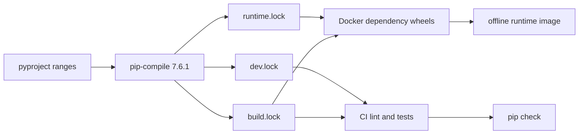

# 0050: Making Python installs reviewable and repeatable

- **Date:** 2026-08-24
- **Status:** implemented and locally validated
- **Related phase:** post-v0.1.0 supply-chain hardening
- **Implementation commit:** `1b0600f`
- **Stacked on:** Draft PR [#11](https://github.com/sangmu1126/kubefit/pull/11)

## Why

`pyproject.toml` intentionally allowed compatible dependency ranges. That is useful
for describing a reusable Python package, but `pip install -e ".[dev]"` and the
Docker builder resolved those ranges again on every run. Two builds from the same
KubeFit commit could therefore install different transitive versions without a code
review.

The previous release boundary pinned container base images, yet the Python packages
inside the image were still mutable. A source tag and image digest can identify what
was published; they cannot by themselves make the inputs to a future rebuild
reviewable.

## What changed

- Added separate hash-locked dependency graphs for production runtime, development,
  and the Hatchling build backend.
- Made CI install the build and development locks with `--require-hashes`, install
  KubeFit without dependency resolution or isolated build downloads, and run
  `pip check`.
- Made the Docker builder create dependency wheels from the runtime lock and build
  the KubeFit wheel from the build lock. The final image remains offline-installed
  from only those local wheels.
- Added a versioned regeneration script that requires `pip-tools==7.6.1`.
- Added structural tests that reject unhashed, non-exact, divergent, or bypassed
  locks.

## How

The project metadata remains the human-maintained compatibility policy. Lock files
are the reviewed installation snapshots used for KubeFit's own CI and image. Keeping
these roles separate avoids falsely claiming that downstream library users must use
one environment while preventing KubeFit's deployment artifacts from silently
floating.

All transitive entries use exact `==` versions and artifact hashes. The generator
omits a machine-specific header and index URL so repeated output is stable and does
not embed local paths or credentials. Runtime, development, and build concerns stay
separate: pytest and Ruff do not enter the production image, while build tools do not
need to remain installed in its final stage.

## Failed validation and correction

The first Python 3.12 container run installed both locks and passed `pip check`, but
27 repository tests failed because the slim test image did not contain the `git`
executable used by GitOps repository tests. This was an environment deficiency, not
a dependency-resolution failure: 310 tests passed and 10 platform-specific tests
were skipped. Installing Git in the disposable test container and rerunning the same
locked environment removed all 27 failures.

Recording this distinction matters. Weakening or skipping GitOps tests would have
hidden a test-environment mismatch instead of testing the supported Python boundary.

## Alternatives considered

| Alternative | Benefit | Problem | Decision |
|---|---|---|---|
| Keep only version ranges | Minimal maintenance | Same commit can resolve differently | Rejected |
| Freeze one development environment | One small file | Test/build tools enter the runtime boundary | Rejected |
| Use exact versions without hashes | Stable resolver choices | Artifact substitution is not checked | Rejected |
| Lock runtime, development, and build graphs with hashes | Reviewable inputs per purpose | Requires intentional regeneration | Selected |

## Evidence

| Check | Result |
|---|---|
| Lock regeneration | All three files retained identical SHA-256 digests |
| Clean Python 3.14 environment | 347 passed; `pip check` passed |
| Python 3.12 Linux container | 337 passed, 10 platform skips; `pip check` passed |
| Production Docker build | Passed on Linux arm64 using runtime/build locks |
| Packaged runtime smoke | Startup, health, dashboard, defaults, and cleanup passed |
| Runtime image dependency check | No broken requirements found |
| Ruff | Passed |

The platform-dependent skip count is expected in the Linux container and is not
reported as equivalent to 347 executed tests. Both runs emitted one upstream
Starlette/httpx deprecation warning.

## Decision and limitations

KubeFit can now claim that CI and production image construction consume reviewed,
hash-checked Python dependency snapshots. Regeneration remains an explicit maintainer
operation and may change when public PyPI publishes newer compatible releases; such a
change must be reviewed as a lock-file diff.

This does not make container builds bit-for-bit reproducible. OS packages, build
timestamps, wheel metadata, and registry behavior remain separate inputs. The locks
were exercised on Python 3.12 and 3.14, but hosted CI still runs only 3.14, so future
compatibility regressions are not yet continuously gated.

## Next question

Can hosted CI continuously enforce KubeFit's declared Python 3.12+ support instead
of relying on one local cross-version validation?
