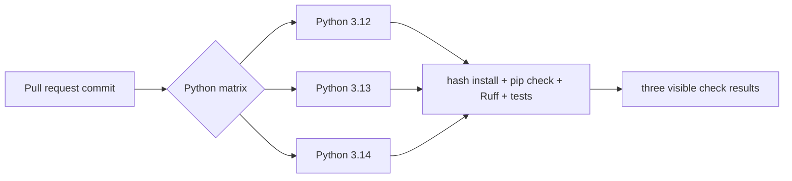

# 0051: Continuously testing the supported Python range

- **Date:** 2026-08-24
- **Status:** validated locally and on GitHub-hosted runners
- **Related phase:** post-v0.1.0 compatibility hardening
- **Feature commit:** `c1c8ac0`
- **Draft PR:** [sangmu1126/kubefit#13](https://github.com/sangmu1126/kubefit/pull/13)
- **Stacked on:** Draft PR [#12](https://github.com/sangmu1126/kubefit/pull/12)

## Why

KubeFit declared `requires-python = ">=3.12"`, but hosted CI exercised only Python
3.14. One disposable 3.12 container had shown that the new lock files could install;
that result would not be repeated after later code or dependency changes, and Python
3.13 had no independent evidence at all.

A package metadata claim is broader than a developer-machine result. Without a
continuous gate, use of a newer standard-library feature or a platform-specific
wheel change could break the lower supported versions while the only CI check stayed
green.

## What changed

- Expanded the existing Python job into Python 3.12, 3.13, and 3.14 matrix entries.
- Gave every entry a versioned check name so a failure identifies its interpreter.
- Disabled matrix fail-fast so one failure does not erase evidence from the other
  versions.
- Kept the same hash-locked build/dev installation, no-resolution project install,
  `pip check`, Ruff, and full test sequence for every version.
- Bound the matrix and the `requires-python` lower limit in a repository contract
  test.

## How

The matrix changes the interpreter, not the verification policy. This is important:
different commands per version could let the oldest version pass a reduced suite and
would weaken the support claim.

`fail-fast: false` costs a small amount of additional runner time on a broken commit,
but returns a complete compatibility map. For example, simultaneous 3.12 and 3.13
failures suggest a lower-version compatibility issue, while one isolated failure
points toward that interpreter or its wheel set.

## Alternatives considered

| Alternative | Benefit | Problem | Decision |
|---|---|---|---|
| Keep only Python 3.14 CI | Lowest runner use | Does not enforce the declared lower bound | Rejected |
| Test only 3.12 and 3.14 | Covers endpoints | A 3.13-only packaging regression stays hidden | Rejected |
| Add tox or nox first | Rich local orchestration | Adds another configuration layer for identical commands | Rejected for now |
| Use a native Actions matrix with fail-fast disabled | Small workflow change and distinct evidence | Runs three Python jobs | Selected |

## Evidence

[GitHub Actions run 32712720058](https://github.com/sangmu1126/kubefit/actions/runs/32712720058)
was triggered by Draft PR #13 and passed on the first attempt.

| Check | Result | Duration |
|---|---|---:|
| Python 3.12 | hash installs, `pip check`, Ruff, tests passed | 37s |
| Python 3.13 | hash installs, `pip check`, Ruff, tests passed | 22s |
| Python 3.14 | hash installs, `pip check`, Ruff, tests passed | 25s |
| Dashboard | tests and production build passed | 14s |
| Helm | lint and default render passed | 7s |
| Docker | production build and packaged runtime smoke passed | 26s |
| Local Python suite | 348 passed; one upstream warning | 10.72s |

The three Python checks appeared independently in the pull request. No manual rerun,
fallback dependency resolution, or version-specific test exclusion was used.

## Decision and limitations

KubeFit can now claim continuous hosted validation on Python 3.12, 3.13, and 3.14
using the same reviewed dependency snapshots and verification commands. This closes
the gap between the currently supported interpreter set and the CI evidence.

The metadata lower bound is open-ended, so a future Python minor is not automatically
tested merely because it is released. Adding or removing an actively supported minor
remains an explicit policy change. GitHub branch protection must also be updated by a
repository administrator if all three versioned checks should be mandatory rather
than informational.

## Next question

Can benchmark comparison order influence latency and throttling enough to change a
before/after verdict, and how should that measurement bias be exposed or reduced?
