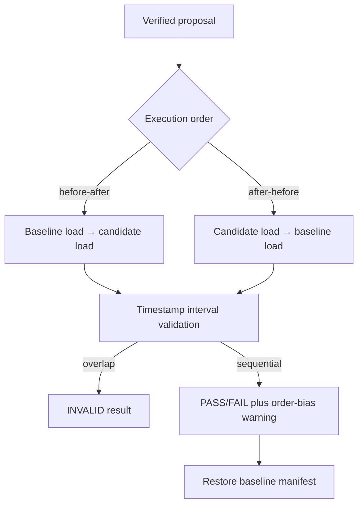

# 0052: Exposing and counterbalancing benchmark order bias

- **Date:** 2026-08-24
- **Status:** implemented and locally validated
- **Related phase:** post-v0.1.0 benchmark correctness hardening
- **Feature commit:** `3bdd486`
- **Stacked on:** Draft PR [#13](https://github.com/sangmu1126/kubefit/pull/13)

## Why

The fixed k6 profile gives both variants the same ten-second warm-up, but KubeFit
always measured baseline before candidate. Any node warm-up, application cache,
background process, thermal change, or general time drift was therefore correlated
with the candidate. A faster candidate could partly reflect being second; a slower
candidate could partly reflect later contention.

The measurement timestamps already retained enough evidence to discover the order,
but the verdict did not validate or explain it. Reviewers saw logical `Before` and
`After` columns without being told whether those were also the chronological order.

## What changed

- Added `--execution-order before-after|after-before` to the disposable-cluster
  benchmark command.
- Refactored the runner to apply, wait, and measure variants in the selected order
  while still storing them under logical before/after fields.
- Kept mandatory restoration to the before manifest after either order, including
  failure and interruption paths.
- Derived actual order from the retained measurement timestamps and invalidated
  overlapping intervals.
- Added an unavoidable `measurement_order_bias` warning to every valid single trial.
- Printed the selected order in CLI JSON, the immutable Markdown report, dashboard
  verdict data, and generated GitHub PR review notes.

## How



The result model remains logically stable: `before` is always the baseline
measurement and `after` is always the candidate measurement. Only their wall-clock
order changes. Existing cost and safety comparison code therefore does not invert
resource semantics when the candidate is executed first.

To counterbalance one proposal, an operator runs two separate trials:

```bash
kubefit benchmark ... --execution-order before-after
kubefit benchmark ... --execution-order after-before
```

Each produces a content-addressed artifact and restores the baseline independently.
The warning follows both artifacts into a generated Draft PR, so a reviewer cannot
mistake either sequential trial for an order-free experiment.

## Alternatives considered

| Alternative | Benefit | Problem | Decision |
|---|---|---|---|
| Keep fixed before→after and rely on 10s warm-up | No extra interface | Warm-up does not remove time drift | Rejected |
| Randomize order silently | Reduces aggregate directional bias | Harder to reproduce and still biases one trial | Rejected |
| Run four measurements and aggregate automatically | Stronger ABBA design | Doubles runtime and requires a new result schema/policy | Deferred |
| Expose both deterministic orders and warn every single trial | Backward-compatible, auditable, enables paired runs | Pair interpretation remains manual | Selected |

## Failure found during validation

The focused implementation suite passed after updating the CLI fake to accept the
new order argument. The first full suite then found one golden pull-request mismatch:
adding the warning correctly changed both the content-addressed benchmark ID and the
PR review notes. The fixture was updated to the newly generated ID and exact warning
rather than suppressing safety evidence to preserve an old digest.

## Evidence

| Check | Result |
|---|---|
| Focused runner/verdict/artifact/review/CLI suite | 104 passed |
| Full Python suite | 353 passed; one upstream Starlette/httpx warning |
| Ruff | Passed |
| Diff whitespace validation | Passed |
| Default order events | verify → before → after → restore before |
| Reverse order events | verify → after → before → restore before |
| Overlapping measurement intervals | Verdict invalid |
| Generated artifact report and PR notes | Actual order and warning retained |

No new live k6 trial was run in this slice. The evidence proves orchestration,
timestamp validation, artifact binding, and reviewer visibility; it does not quantify
how much order bias exists on the current local machine.

## Decision and limitations

KubeFit can now run either chronological order without changing logical comparison
semantics, and no valid single result can hide that its measurements were sequential.
Two opposite-order trials reduce systematic ordering risk for a human review.

KubeFit does not yet bind those two artifact IDs into one paired assessment, calculate
cross-order variance, or require both to agree before PR publication. A single passing
artifact can still produce a Draft PR, now with an explicit warning. Automatic ABBA
aggregation and statistically justified repetition remain outside this slice.

## Next question

How should two opposite-order artifacts be bound to the same proposal and converted
into one agreement or disagreement decision before GitOps publication?
