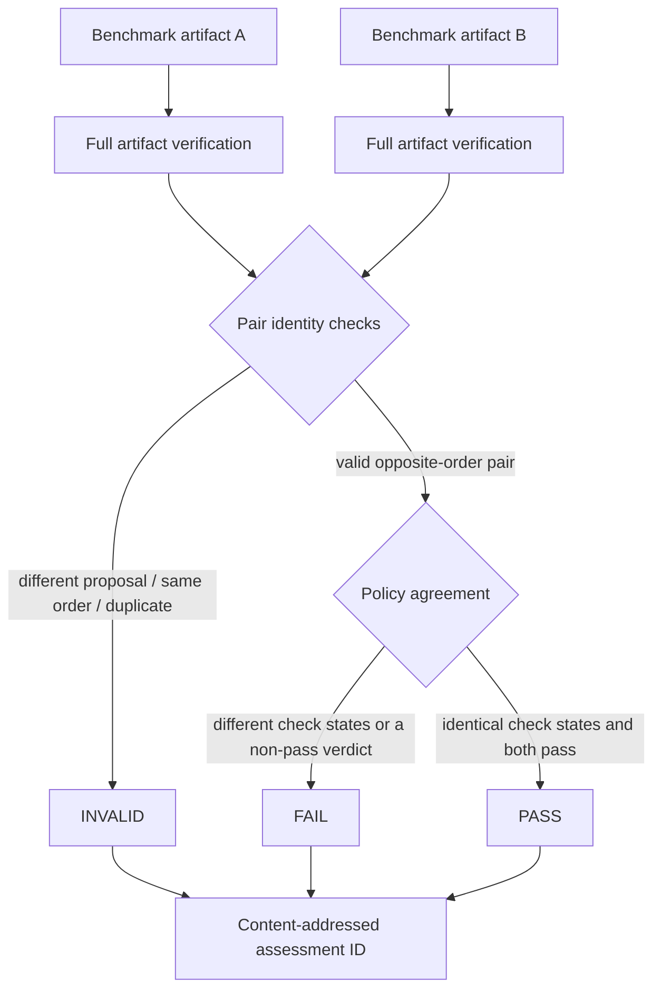

# 0053: Turning opposite-order trials into one policy decision

- **Date:** 2026-08-24
- **Status:** implemented and locally validated
- **Related phase:** post-v0.1.0 benchmark correctness hardening
- **Feature commit:** `ea9d62f`
- **Stacked on:** Draft PR [#14](https://github.com/sangmu1126/kubefit/pull/14)

## Why

Entry 0052 made baseline-first and candidate-first trials possible, but left two
independent benchmark artifacts and two independent verdicts. A reviewer had to
manually verify that they referenced the same proposal, used opposite chronological
orders, retained the same cost/profile basis, and reached compatible policy results.

That manual join was easy to get wrong. Passing the same artifact twice, combining
two baseline-first trials, or comparing different proposals could look like a
counterbalanced experiment without actually being one.

## What changed

- Added a read-only `kubefit benchmark-pair` command accepting two result directories.
- Fully reloads and semantically verifies both immutable benchmark artifacts before
  assessing the pair.
- Requires distinct artifact IDs, the same proposal, exactly one of each execution
  order, the same load profile, and identical before/after cost bases.
- Compares all non-order policy check statuses and requires both individual verdicts
  to pass.
- Returns machine-enforceable `pass`, `fail`, or `invalid` status with structured
  checks, failures, invalid reasons, and limitations.
- Produces the same content-addressed `benchmark-pair-<digest>` assessment ID
  regardless of CLI input order.

## How



`invalid` means the inputs do not form a comparable counterbalanced pair. `fail`
means they are comparable, but the candidate was not safe in both orders or the
policy check states disagreed. Only `pass` means both chronological orders satisfy
the same existing safety policy.

The order-specific `measurement_order_bias` warning is excluded from policy-state
comparison because its reason must differ between the two trials. Every other check,
including OOM, throttling, recovery, offered load, restarts, and cost warnings,
remains part of the agreement map.

## CLI contract

```bash
kubefit benchmark-pair \
  --first benchmarks/results/benchmark-<before-first-digest> \
  --second benchmarks/results/benchmark-<candidate-first-digest>
```

The command prints canonical structured JSON. PASS returns exit code 0; FAIL and
INVALID print their complete assessment and return exit code 2, allowing a shell or
future publication preflight to enforce the result without scraping prose. It does
not contact Kubernetes, Prometheus, Git, or GitHub.

## Alternatives considered

| Alternative | Benefit | Problem | Decision |
|---|---|---|---|
| Ask reviewers to compare two reports manually | No code | Identity and order mistakes stay possible | Rejected |
| Average every metric immediately | One number | Two samples do not justify statistical confidence | Rejected |
| Require byte-identical measurements | Very strict | Normal runtime measurements can never match exactly | Rejected |
| Require input identity plus existing policy-state agreement | Reuses reviewed safety policy | Does not estimate numeric variance | Selected |

## Evidence

| Check | Result |
|---|---|
| Focused pair and CLI suite | 31 passed |
| Full Python suite | 359 passed; one upstream Starlette/httpx warning |
| Ruff | Passed |
| Opposite-order input arguments reversed | Identical assessment and ID |
| Same artifact passed twice | INVALID: duplicate and not opposite-order |
| Distinct artifacts with the same order | INVALID: not opposite-order |
| Candidate OOM in one order | FAIL: policy disagreement and not both pass |
| Non-pass CLI result | Structured JSON plus exit code 2 |

No live load was rerun. Tests create fully hashed benchmark bundles through the real
runner and artifact writer, then load them through the production verification path.

## Decision and limitations

KubeFit can now distinguish a valid opposite-order pair from malformed inputs and
reduce two trials to one deterministic policy agreement decision. This removes the
manual identity/order join and makes disagreement machine-visible.

PASS does not mean the latency deltas are statistically significant. Two trials do
not estimate run-to-run variance, and the assessment intentionally compares policy
states rather than averaging measurements. The assessment is currently printed but
not published as its own atomic directory, and the GitOps publication commands still
accept one benchmark artifact. Therefore pair PASS is not yet a mandatory PR gate.

## Next question

How should this assessment be persisted and required by publication preflight without
breaking the existing content-addressed GitOps evidence chain?
