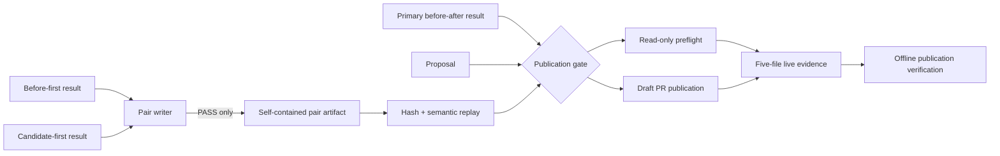

# 0054: Making counterbalanced evidence mandatory for publication

- **Date:** 2026-08-24
- **Status:** implemented and locally validated
- **Related phase:** post-v0.1.0 benchmark correctness hardening
- **Feature commit:** `b5e3183`
- **Stacked on:** Draft PR [#15](https://github.com/sangmu1126/kubefit/pull/15)

## Why

Entry 0053 produced a deterministic pair decision, but only printed it. The output
could be lost, a reviewer could select only the favorable trial, and the publication
commands still accepted one benchmark result. Counterbalancing therefore improved
analysis without actually strengthening the GitOps gate.

The publication boundary needs independently replayable evidence, not a trusted JSON
snippet. A Draft PR must prove that both chronological orders passed the same policy
and that its displayed primary comparison is one of those verified trials.

## Success criteria

- Persist only PASS pairs as immutable, content-addressed artifacts.
- Make each pair self-contained and independently replay both embedded trials.
- Reject missing, tampered, mismatched, FAIL, or INVALID pair evidence before mutation.
- Bind the pair ID and both member IDs through preflight and offline verification.
- Preserve the existing one-trial metric table without allowing an unrelated result.

## What changed

- `kubefit benchmark-pair` now writes PASS to `benchmarks/pairs/benchmark-pair-<digest>`
  and reports its path, file count, and idempotent reuse state.
- The pair bundle contains `pair.json`, `assessment.json`, `report.md`, and complete
  copies of both nine-file benchmark bundles: 21 canonical files in total.
- The loader rejects symlinks, missing or additional files, hash mismatches, a changed
  report or assessment, non-PASS state, and any result that fails semantic replay.
- `publish-check`, `publish`, and `verify-publication` now require
  `--benchmark-pair`. The primary benchmark must be the pair's before-after member.
- Pull request plan schema v2 and publication verification schema v2 bind the pair ID
  and the two sorted benchmark IDs. The Draft PR body displays this evidence.

## How



The important boundary is the replay step. Publication does not trust the stored
assessment: it loads both copied result bundles through the normal result verifier,
recomputes the pair policy and Markdown report, and compares the canonical bytes and
hashes before building a plan.

Publication retains one explicit before-after result because that trial supplies the
existing before/after metric table. Requiring it to be a member of the pair prevents a
caller from combining a valid pair with a more favorable unrelated result.

The writer follows the existing immutable artifact protocol: private staging,
canonical serialization, per-file hashes, directory-content digest, `fsync`, an
exclusive publication lock, and one atomic rename. An identical retry reuses exact
bytes; a collision fails without overwriting evidence.

### Alternatives and trade-offs

| Option | Benefit | Cost or risk | Decision |
|---|---|---|---|
| Store only assessment JSON | Small artifact | Cannot replay the source results if paths move | Rejected |
| Reference two external result paths | No duplicated bytes | Pair is not portable or self-contained | Rejected |
| Embed both complete result bundles | Independent replay and review | Duplicates benchmark bytes | Selected |
| Remove the primary result argument | Simpler CLI | Requires redesigning the existing metric presentation | Deferred |
| Allow FAIL/INVALID artifacts into publication | Keeps diagnostic history | Makes a non-publishable directory look publishable | Rejected |

## Problems encountered

The previous plan and verification schemas represented exactly one benchmark ID.
Adding the pair only at the CLI would have left captured preflight evidence unable to
prove which two trials were checked. The schemas were intentionally advanced to v2,
and pair identity is included in the publication verification digest.

The first documentation pass also exposed stale operational instructions that called
the pair optional. README, architecture, local development, implementation plan, and
the live GitHub runbook now use the same mandatory three-artifact contract.

## Evidence

### Reproduction

```bash
.venv/bin/ruff check .
.venv/bin/pytest -q
git diff --check
```

### Results

| Signal | Result | Interpretation |
|---|---:|---|
| Full Python suite | 363 passed | Existing and new publication paths remain green |
| Pair bundle exact set | 21 files | Both original nine-file bundles are retained with pair metadata |
| Reversed input order | Same pair ID and reused bytes | Identity is independent of CLI argument order |
| Embedded verdict tamper | Rejected | Stored hashes and semantic replay fail closed |
| Duplicate input | INVALID; no pair persisted | Malformed evidence cannot enter publication |
| Ruff and diff check | Passed | Code and retained text satisfy repository gates |

Tests construct real hashed benchmark bundles, write and reload the pair, tamper with
embedded evidence, exercise CLI exit behavior, and rebuild publication evidence. No
live Kubernetes load or GitHub write was required for this slice.

## Decision and limitations

KubeFit can now claim that every newly planned Draft PR is gated by two verified,
opposite-order PASS trials and that offline evidence binds the same pair. It cannot
claim statistical significance: two trials still do not estimate variance. The pair
duplicates raw evidence to remain portable, and schema v1 captured publication
evidence must be recaptured rather than silently upgraded.

## Next question

How should the dashboard and PR review show the direction and spread between the two
orders while making it unmistakable that two samples are not a confidence interval?
