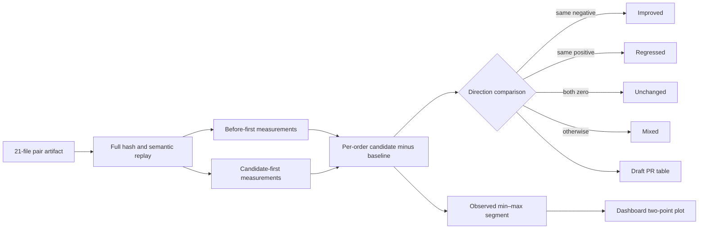

# 0055: Showing two observations without inventing confidence

- **Date:** 2026-08-24
- **Status:** implemented and locally validated
- **Related phase:** post-v0.1.0 benchmark explainability hardening
- **Feature commit:** `880ddbd`
- **Stacked on:** Draft PR [#16](https://github.com/sangmu1126/kubefit/pull/16)

## Why

The persisted pair proved that both chronological orders passed the same safety policy,
but reviewers still could not see whether measured latency, throttling, and recovery
moved in the same direction. Showing only PASS hid useful disagreement; averaging two
values would hide it further and imply more statistical confidence than two trials can
support.

KubeFit needs to expose both observations directly. A reviewer should see direction and
spread while the product remains explicit that the spread is not variance or a
confidence interval.

## Success criteria

- Derive the same six comparisons from fully replayed pair evidence for every consumer.
- Keep both order-specific changes visible rather than replacing them with an average.
- Mark improvement, regression, equality, or mixed direction deterministically.
- Handle zero baselines without infinite or fabricated percentages.
- Display the same result in the Draft PR and a shareable read-only dashboard.
- State beside the visualization that two points do not establish significance.

## What changed

- Added a pair review projection for steady/spike P95/P99 latency, CPU throttling P95,
  and traffic-spike recovery.
- Each metric retains before, after, native-unit delta, optional percent change, actual
  execution order, observed minimum/maximum, and combined direction.
- The Draft PR now includes a counterbalanced table with before-first, candidate-first,
  observed range, and direction columns.
- Added a fully replayed pair API under
  `/v1/benchmark-pairs/{benchmark-pair-id}/review`, disabled unless an operator sets a
  regular read-only pair root.
- Added `/?pair=benchmark-pair-<digest>` dashboard review with a zero-centered range
  plot, two colored order points, direction summary, and statistical limitation.
- Ambiguous links containing both `benchmark` and `pair` are rejected.

## How



The diagram's segment connects exactly two observed deltas. It communicates direction
and order sensitivity; it does not estimate a population distribution.

For a nonzero baseline, the displayed change is:

```text
(candidate - baseline) / baseline × 100
```

When the baseline is zero, percentage change is undefined. KubeFit preserves `null`
and displays the signed native-unit delta. Both PR and UI therefore avoid `Infinity%`
or a made-up denominator.

### Visual interpretation

```text
improvement ←────────── 0 ──────────→ regression
                 ●─────●
             before   candidate
```

The two points identify execution order, and the connecting line is only their observed
minimum–maximum range. Mixed direction is intentionally visible even when both trials
remain within policy thresholds and the pair verdict is PASS.

### Alternatives and trade-offs

| Option | Benefit | Cost or risk | Decision |
|---|---|---|---|
| Average the two changes | Compact single number | Hides order disagreement and overstates evidence | Rejected |
| Calculate a confidence interval | Familiar statistic | Two trials cannot support a meaningful estimate | Rejected |
| Show raw values only | No derived claim | Direction and order sensitivity remain hard to scan | Rejected |
| Show two changes plus observed range | Preserves both observations | Requires an explicit non-statistical label | Selected |
| Persist the projection in pair.json | Faster reads | Changes immutable artifact identity for presentation data | Rejected |

## Problems encountered

The first combined validation invoked `npm` from the repository root, where no
`package.json` exists. Python had already passed; the frontend command failed with
`ENOENT` before running any test. The command was corrected to use
`npm --prefix dashboard`, then both the test and production build passed. This was an
execution-path error, not a product defect.

Zero CPU-throttling baselines also exposed a numerical trap. Converting a positive
delta from zero into a percentage would be undefined. The review model keeps the
percentage nullable and tests the native-unit fallback explicitly.

## Evidence

### Reproduction

```bash
.venv/bin/ruff check .
.venv/bin/pytest -q
npm --prefix dashboard test -- --run
npm --prefix dashboard run build
git diff --check
```

### Results

| Signal | Result | Interpretation |
|---|---:|---|
| Python suite | 369 passed | Pair replay, projection, API, and PR remain integrated |
| Dashboard suite | 13 passed | Pair query, labels, plot, and ambiguity rejection are covered |
| Dashboard production build | Passed | TypeScript and bundled UI compile successfully |
| Opposite metric directions | `mixed` | A PASS pair cannot hide direction disagreement |
| Zero baseline | Native delta; percentage `null` | No infinite percentage is presented |
| Ruff and diff check | Passed | Source and retained text satisfy repository gates |

The tests use real content-addressed pair bundles for the replay boundary and targeted
measurements for improved, regressed, unchanged, mixed, and zero-baseline behavior. No
new live Kubernetes benchmark was run in this slice.

## Decision and limitations

KubeFit can now claim that reviewers see both order-specific changes and whether their
directions agree. It cannot claim that the displayed range estimates variance, a
confidence interval, or production behavior. The scale is normalized independently
for each metric, so bar lengths compare direction and within-row spread, not magnitude
across unlike units.

Pair dashboard links require an operator-provided read-only artifact root. KubeFit does
not upload benchmark evidence or expose local files automatically.

## Next question

What repeated-pair count, randomization rule, and stopping condition are required
before KubeFit may report run-to-run variance instead of only observed points?
