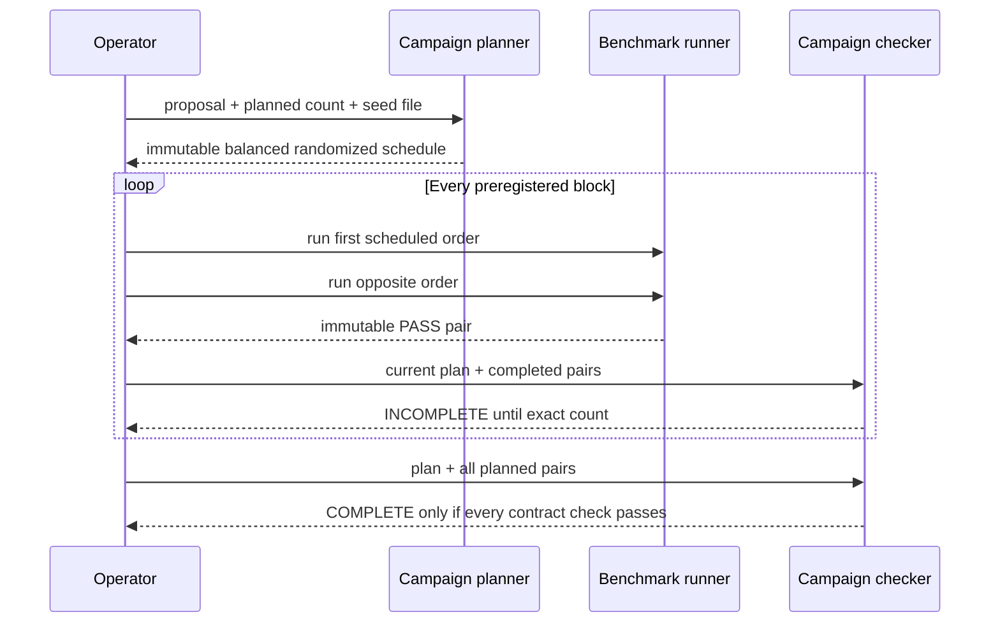

# 0056: Freezing repeated-pair rules before seeing outcomes

- **Date:** 2026-08-24
- **Status:** implemented and locally validated
- **Related phase:** post-v0.1.0 experimental-design hardening
- **Feature commit:** `77830fe`
- **Stacked on:** Draft PR [#17](https://github.com/sangmu1126/kubefit/pull/17)

## Why

Entry 0055 made two observations visible but correctly refused to call their range a
variance estimate. Collecting more pairs without a plan would not solve that problem:
an operator could stop after favorable outcomes, extend an unfavorable experiment,
reuse evidence, or always begin with the same order. The resulting sample count and
time trend would be outcome-dependent.

The collection rule must therefore exist before the results. KubeFit first needs to
verify experimental discipline; statistical aggregation can be considered only after
that boundary is trustworthy.

## Evidence basis

The NIST Engineering Statistics Handbook describes blocking as a way to hold important
nuisance factors together and summarizes the practical rule as “block what you can,
randomize what you cannot.” It also defines replication as repeating a treatment and
randomization as preventing run conditions from being predictable from their sequence.
Those principles support treating each close-in-time opposite-order pair as a block and
randomizing which order begins the block. They do not supply a universal sample count
for KubeFit's workload. ([NIST randomized block designs](https://www.itl.nist.gov/div898/handbook/pri/section3/pri332.htm),
[NIST DOE glossary](https://www.itl.nist.gov/div898/handbook/pri/section7/pri7.htm))

## Success criteria

- Freeze proposal, pair count, order schedule, and stopping rule before collection.
- Balance which chronological execution order starts a block and randomize placement.
- Keep the raw seed out of the retained artifact while making retries deterministic.
- Distinguish valid progress from complete and structurally invalid evidence.
- Reject reused evidence, environment-contract drift, overlap, and schedule violations.
- Make no aggregate effect, power, confidence, or significance claim.

## What changed

- Added `kubefit benchmark-campaign-plan` with an explicit 2–100 pair count and a
  regular seed file of 16–4096 bytes.
- Publishes a two-file immutable `benchmark-campaign-<digest>` containing canonical
  `campaign.json` and a human-readable schedule in `report.md`.
- Balances first-trial orders to equal counts, or a difference of one for odd totals,
  then applies a deterministic seed-derived shuffle.
- Stores only the seed SHA-256 commitment and fixes the stopping rule to
  `complete_all_planned_pairs`.
- Added `kubefit benchmark-campaign-check`, which fully replays every supplied pair,
  derives chronological blocks from measurement timestamps, and returns `complete`,
  `incomplete`, or `invalid` with structured checks.

## How



Each pair is one time block because its two trials are intended to run close together
under the same controlled environment. Pair artifacts are sorted by their retained
timestamps, not CLI argument order. A block is invalid if its two full trials overlap;
campaign blocks must also be chronological and non-overlapping.

Completion requires:

| Check | Failure prevented |
|---|---|
| Exact planned count | Outcome-dependent early stop or post-hoc extension |
| Unique pair and benchmark IDs | Reusing one favorable observation |
| One proposal | Comparing different resource changes |
| One profile and cost basis | Changing load or economic assumptions mid-study |
| Non-overlapping blocks | Treating concurrent evidence as ordered replication |
| Scheduled first order | Reintroducing systematic chronological bias |

The campaign ID covers the complete schedule, seed hash, count, stopping rule, and
limitations. Identical creation retries reuse byte-exact content through private
staging, an exclusive lock, `fsync`, and atomic rename.

### Alternatives and trade-offs

| Option | Benefit | Cost or risk | Decision |
|---|---|---|---|
| Hard-code three or five pairs | Simple guidance | Pretends one count fits every effect size and risk | Rejected |
| Let the operator stop when results look stable | Saves time | Outcome-dependent stopping biases evidence | Rejected |
| Always alternate a fixed AB/BA pattern | Balanced | Predictable time trend can align with order | Rejected |
| Randomize every individual variant globally | Strong randomization | Breaks close-in-time pair blocking and restoration flow | Rejected |
| Randomize the first trial within balanced pair blocks | Preserves pair control and limits order imbalance | Does not randomize cluster conditions | Selected |

## Problems encountered

The first design used three planned pairs as a minimum. There was no KubeFit-specific
power analysis supporting that number, so it risked looking like a statistical
threshold. The lower bound was changed to two: it means only that a complete pair is
replicated, while the caller still chooses the preregistered total from its decision
risk and budget. The model explicitly denies that two—or any count by itself—establishes
confidence.

Retaining the raw randomization seed would make schedule reproduction easy but would
unnecessarily copy caller-controlled bytes into evidence. KubeFit retains its hash and
the frozen schedule instead. That commitment detects schedule changes but cannot prove
the seed was generated with good entropy or chosen without searching for a preferred
schedule; this limitation is stored in every plan and completion result.

## Evidence

### Reproduction

```bash
.venv/bin/ruff check .
.venv/bin/pytest -q
npm --prefix dashboard test -- --run
npm --prefix dashboard run build
git diff --check
```

### Results

| Signal | Result | Interpretation |
|---|---:|---|
| Python suite | 377 passed | Planner, artifact replay, completion, CLI, and regressions pass |
| Dashboard suite | 13 passed | Existing review UI remains unchanged and green |
| Dashboard production build | Passed | Packaged frontend still compiles |
| Five-pair schedule | First-order counts differ by one | Odd totals remain balanced |
| Exact deterministic retry | Same campaign ID; byte reuse | Plan identity is stable |
| Valid schedule prefix | INCOMPLETE, exit 2 | Partial favorable data cannot look complete |
| Full scheduled campaign | COMPLETE, exit 0 | Exact preregistered evidence is accepted |
| Reversed scheduled order | INVALID, exit 2 | First-order manipulation is visible |

Tests construct real proposal, benchmark result, and persisted pair artifacts. They
shift retained timestamps into controlled non-overlapping blocks, reverse CLI input
paths to prove timestamp ordering, and deliberately violate one randomized block. No
live Kubernetes workload was run.

## Decision and limitations

KubeFit can now claim that a repeated-pair collection followed a frozen balanced order
and complete-all stopping contract. It cannot claim random sampling of production
traffic, adequate statistical power, a treatment-effect estimate, variance, confidence
interval, or significance.

Campaign checking is currently read-only and its result is not persisted or required
by Draft PR publication. This avoids silently turning an advanced and expensive
experiment into an MVP requirement before the product policy is decided.

## Next question

Should a completed campaign remain optional reviewer evidence, or should a stricter
publication mode require it before KubeFit may make repeated-run stability claims?
