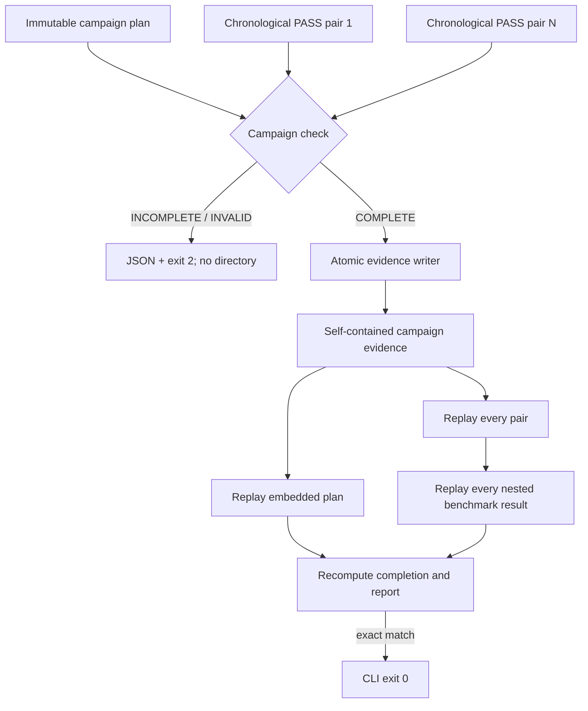

# 0057: Making completed campaigns independently replayable

- **Date:** 2026-08-24
- **Status:** implemented and locally validated
- **Related phase:** post-v0.1.0 experimental-evidence hardening
- **Feature commit:** `9aac6f9`
- **Stacked on:** Draft PR [#18](https://github.com/sangmu1126/kubefit/pull/18)

## Why

Entry 0056 could decide whether a set of pair paths completed a preregistered campaign,
but the result existed only on stdout. Copying that JSON elsewhere would separate the
decision from the plan and nested raw benchmark evidence that justified it. An auditor
would need the original directory layout and could not prove that the supplied pairs
were the ones originally checked.

Repeated campaigns should remain optional for the MVP because even the minimum requires
four full before/after trials. Optional must not mean unverifiable, however. A completed
campaign needs one portable artifact that can replay itself before it is ever offered
as advanced PR evidence.

## Success criteria

- Persist COMPLETE campaigns only; create nothing for INCOMPLETE or INVALID.
- Embed the exact campaign plan and every complete pair bundle.
- Bind chronological pair order independently of CLI path order.
- Hash the exact file set and replay all nested semantic decisions.
- Regenerate the human-readable report rather than trusting stored prose.
- Reuse only byte-identical retries and never overwrite conflicting evidence.

## What changed

- `benchmark-campaign-check` now accepts `--output-dir`, defaulting to
  `benchmarks/campaign-evidence`.
- COMPLETE produces `benchmark-campaign-evidence-<digest>` and reloads it before the
  CLI returns exit 0.
- The evidence index binds the campaign ID, proposal ID, chronological pair IDs,
  per-file size/SHA-256 metadata, and aggregate content digest.
- The artifact embeds `campaign/<campaign-id>/`, `completion.json`, `report.md`, and
  every pair under `pairs/<pair-id>/`.
- The loader verifies hashes and exact paths, replays the nested campaign loader, pair
  loaders, campaign completion, evidence ID, and generated report.

## How



For `N` completed pairs, the exact artifact contains:

| Content | Files |
|---|---:|
| Evidence index | 1 |
| Completion and root report | 2 |
| Embedded campaign plan and report | 2 |
| `N` complete pair bundles | `21 × N` |
| Total | `21N + 5` |

A three-pair test campaign therefore retains 68 files. The evidence ID is derived from
the plan, proposal, chronological pair IDs, and hashes of all embedded source payloads.
The generated root report is then included in the independently verified aggregate
content digest.

The writer uses the established artifact protocol: private staging, mode 0600 files,
directory `fsync`, exclusive lock, atomic rename, and byte-exact retry validation.
Reversing input paths produces the same completion order, ID, and bytes because the
campaign checker sorts verified measurement timestamps.

### Alternatives and trade-offs

| Option | Benefit | Cost or risk | Decision |
|---|---|---|---|
| Keep stdout JSON only | No duplicated storage | Cannot replay or transport the evidence | Rejected |
| Store only pair IDs and hashes | Small artifact | Requires original external pair roots | Rejected |
| Use filesystem hard links | Low local duplication | Copying breaks portability and link semantics complicate trust | Rejected |
| Embed every complete pair | Self-contained semantic replay | Duplicates all raw k6 evidence | Selected |
| Make campaign evidence mandatory for every PR | Stronger default | Multiplies MVP benchmark time and cost | Rejected for now |

## Problems encountered

The first embedded layout placed plan files directly under `campaign/`. The existing
campaign loader deliberately requires the directory name to equal the campaign ID, so
the first focused test failed before semantic replay. Weakening that loader would have
removed an identity boundary. The layout was instead corrected to
`campaign/<campaign-id>/`, preserving the same directory-to-ID check inside and outside
the enclosing evidence artifact.

The evidence ID cannot directly hash a report containing that same ID without a
circular definition. KubeFit derives the ID from all source payloads except the root
report, renders the report with that ID, and then binds the report into the separate
aggregate content digest stored by the index. Loading independently checks both layers.

## Evidence

### Reproduction

```bash
.venv/bin/ruff check .
.venv/bin/pytest -q
npm --prefix dashboard test -- --run
npm --prefix dashboard run build
git diff --check
```

### Results

| Signal | Result | Interpretation |
|---|---:|---|
| Python suite | 381 passed | Writer, loader, CLI, tamper checks, and regressions pass |
| Dashboard suite | 13 passed | Existing review UI remains green |
| Dashboard production build | Passed | Packaged frontend still compiles |
| Three-pair artifact | 68 exact files | Plan and all nested evidence are retained |
| Reversed pair arguments | Same ID and byte reuse | Identity follows measured chronology |
| Embedded pair tamper | Rejected | Nested evidence cannot change silently |
| Incomplete campaign | No output root created | Non-complete evidence cannot look publishable |

Tests construct the actual proposal, result, pair, campaign, and campaign-evidence
layers. They use controlled timestamps rather than a live cluster, deliberately alter
an embedded assessment, and load through the production replay path. No live Kubernetes
workload was run.

## Decision and limitations

KubeFit can now claim that a COMPLETE repeated campaign is portable and independently
replayable. It still cannot claim adequate power, variance, confidence, statistical
significance, or production representativeness.

Portability duplicates raw evidence and currently has no storage quota or retention
policy. Campaign evidence is not yet displayed by the dashboard or accepted by Draft
PR publication. The mandatory MVP gate remains one persisted opposite-order pair.

## Next question

How should an operator explicitly attach completed campaign evidence to a Draft PR
without making that expensive evidence mandatory for every publication?
