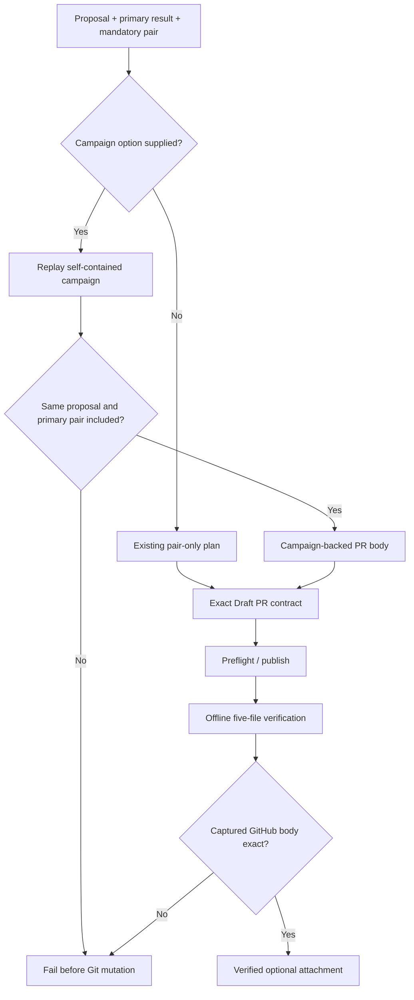

# 0058: Attaching completed campaigns without widening the default gate

- **Date:** 2026-08-24
- **Status:** implemented and locally validated
- **Related phase:** post-v0.1.0 experimental-evidence hardening
- **Feature commit:** `3bf16c1`
- **Stacked on:** Draft PR [#19](https://github.com/sangmu1126/kubefit/pull/19)

## Why

Entry 0057 made a completed repeated campaign portable, but the publication boundary
could not consume it. A reviewer could receive the normal mandatory pair or a campaign
artifact through a separate channel, yet the Draft PR did not prove which optional
evidence the operator intended to present.

Making every publication require repeated campaigns would turn a minimum two-pair plan
into four full before/after trials and widen the MVP cost and duration. The safer product
boundary is explicit selection: pair-only remains the default, while one supplied
campaign becomes part of the exact PR contract.

## Success criteria

- Preserve byte-for-byte existing PR output when no campaign option is supplied.
- Fully replay a supplied campaign before planning or repository mutation.
- Require the mandatory publication pair to belong to that campaign.
- Show campaign identity, completion, ordered blocks, and a no-significance caveat.
- Carry the optional identity through preflight, publication output, and offline proof.
- Prove the captured GitHub body equals the generated campaign-backed body.
- Do not upload raw campaign evidence or edit an existing divergent PR.

## What changed

- `publish`, `publish-check`, and `verify-publication` accept the optional
  `--benchmark-campaign-evidence PATH` argument.
- `PullRequestPlan` carries an all-or-none campaign reference: evidence ID, campaign ID,
  and two to 100 typed pair IDs.
- Planning requires proposal equality and primary-pair membership after loading the
  entire self-contained campaign.
- The Draft PR adds a preregistered-campaign section only when explicitly selected.
- Preflight and publication JSON expose the campaign evidence ID without exposing raw
  results or the PR body.
- Offline verification requires the optional identifiers to agree and, for campaign
  evidence, requires the independently captured GitHub body to match exactly.

## How



The conclusion is that optional evidence joins the same fail-closed contract; it is
not an unverified annotation added after publication.

### Trust boundaries

| Boundary | Required evidence | Failure behavior |
|---|---|---|
| Default publication | Proposal, primary result, mandatory PASS pair | Existing behavior unchanged |
| Optional campaign input | Replayed COMPLETE artifact for the same proposal | Planning stops |
| Pair membership | Mandatory pair ID appears in chronological campaign IDs | Planning stops |
| Existing GitHub PR | Title and complete body equal the selected plan | Reuse stops; no edit |
| Offline proof | Preflight/output IDs and captured GitHub body agree | Verification stops |

## Problems encountered

### A same-proposal campaign is not enough

Initially, proposal equality looked sufficient because every campaign pair already
references that proposal. It would still allow the mandatory pair shown in the main
benchmark table to be unrelated to the optional repeated campaign. The final rule
requires direct pair membership, so the basic and advanced evidence describe the same
measurement set.

### IDs were strings before becoming path components

The campaign loader used indexed pair IDs to resolve nested directories, but its list
items had only generic string validation. Accepting campaign evidence at the PR boundary
made that latent path boundary more important. Pair IDs are now pattern-validated before
nested resolution; a traversal-shaped ID is rejected as an invalid index.

### Publication evidence proved the title, not the attachment

The five-file verifier previously checked the GitHub title but did not capture the body.
That was adequate for the old identity set but could not prove that a campaign table was
actually present. `github-pr.json` can now carry `body`; it is mandatory for a campaign
verification and compared byte-for-byte with the replayed plan. Older non-campaign
captures without `body` remain compatible.

### Optional evidence and deterministic branches

The manifest bytes and commit are identical with or without the optional campaign, so
the deterministic branch name also stays identical. Automatically editing an existing
PR would weaken the idempotent exact-body rule. KubeFit therefore requires the operator
to select the campaign before first publication and rejects a divergent existing body.

## Evidence

### Reproduction

```bash
.venv/bin/ruff check .
.venv/bin/pytest -q
npm --prefix dashboard test -- --run
npm --prefix dashboard run build
git diff --check
```

### Results

| Signal | Result | Interpretation |
|---|---:|---|
| Python suite | 386 passed | Optional and unchanged paths pass together |
| Dashboard suite | 13 passed | Existing pair review remains green |
| Dashboard production build | Passed | Packaged frontend still compiles |
| No campaign option | Golden PR body unchanged | Repeated evidence is not an implicit gate |
| Campaign with primary pair | Accepted | IDs and chronological block table are rendered |
| Campaign without primary pair | Rejected | Unrelated advanced evidence cannot decorate the PR |
| Edited captured body | Rejected | Offline proof covers the actual attachment |
| Traversal-shaped pair ID | Rejected before path resolution | Nested artifact lookup stays bounded |

Tests use complete content-addressed proposal, result, pair, campaign, and campaign
evidence artifacts with controlled timestamps. No live Kubernetes workload or GitHub
publication was performed for this slice.

## Decision and limitations

KubeFit now supports an explicit, verifiable repeated-campaign reference in a Draft PR
without making it mandatory. “Attachment” means binding identifiers and review content
to the PR contract; the large self-contained artifact is not uploaded to GitHub and
must still be retained through the operator's evidence-storage process.

The PR displays collection completion, not an aggregate treatment effect. It still
cannot claim variance, confidence, power, significance, or production
representativeness. Existing Draft PRs are never rewritten to add later evidence, and
this path has not yet been exercised against a disposable live GitHub repository.

## Next question

Can a read-only campaign dashboard make the ordered repeated evidence easier to inspect
without averaging the blocks or implying statistical confidence?
