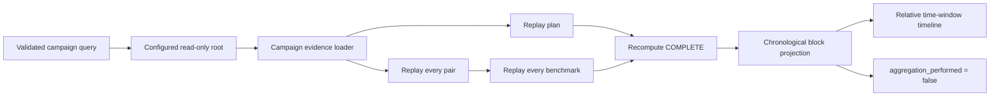

# 0059: Visualizing repeated collection without inventing an aggregate

- **Date:** 2026-08-24
- **Status:** implemented and locally validated
- **Related phase:** post-v0.1.0 experimental-evidence review
- **Feature commit:** `3b9fc7b`
- **Stacked on:** Draft PR [#20](https://github.com/sangmu1126/kubefit/pull/20)

## Why

Completed campaign evidence was replayable and could be bound to a Draft PR, but a
reviewer still had to read a report and many content-addressed IDs. The dashboard could
make collection discipline easier to inspect, but plotting an average or error bar from
two or a few pairs would imply analysis that KubeFit does not perform.

The useful visual question is narrower: did every preregistered block occur, in which
order, over what observed time window, and did the scheduled first trial match the
actual first trial?

## Success criteria

- Expose campaign evidence only from an explicitly configured read-only root.
- Replay the complete plan, every pair, every benchmark result, and completion decision.
- Return chronological block identity, order, and timestamps without metric aggregation.
- Make the absence of aggregation a typed API field rather than UI prose alone.
- Render relative block position and duration without encoding performance magnitude.
- Reject malformed or ambiguous benchmark, pair, and campaign share links.
- Preserve the existing analysis, benchmark, and pair review paths.

## What changed

- Added `BenchmarkCampaignReview` and `BenchmarkCampaignBlockReview` projections.
- Added `review_benchmark_campaign_evidence`, which loads the complete self-contained
  artifact once and derives its chronological block view.
- Added `GET /v1/benchmark-campaigns/{artifact_id}/review`, disabled unless
  `KUBEFIT_BENCHMARK_CAMPAIGN_EVIDENCE_DIRECTORY` points to a regular directory.
- Added the shareable `/?campaign=benchmark-campaign-evidence-<digest>` route.
- Added a COMPLETE gate, completion/check cards, scheduled-versus-observed order, and a
  relative measurement-window timeline.
- Extended query ambiguity protection from two review modes to all three stored modes.

## How



The visual encodes collection sequence and elapsed window only. It deliberately has no
axis for latency, throttling, cost, or treatment effect.

### Response boundary

| Returned | Why it is reviewable |
|---|---|
| Evidence, campaign, proposal IDs | Preserve content-addressed identity |
| Planned/completed pair count | Show complete-all stopping compliance |
| Scheduled and observed first order | Expose randomization adherence |
| Block start and finish | Show chronological separation and collection duration |
| Pair and benchmark IDs | Retain drill-down identity |
| Checks and limitations | Keep the decision explainable |
| `aggregation_performed: false` | Prevent consumers from assuming an effect estimate |

| Not returned | Reason |
|---|---|
| Campaign mean or weighted mean | No estimator has been defined |
| Variance or error bars | The campaign does not compute them |
| Confidence interval or p-value | No power or inference design exists |
| Favorable-block filter | Would violate complete-all collection discipline |

## Problems encountered

### Adjacent windows intentionally have different list lengths

The first chronological test compared `N` blocks with the `N-1` following blocks using
`zip(..., strict=True)`. Python correctly raised because the lengths differ. Adjacency
is intentionally an offset comparison, so the test now uses `strict=False` and asserts
each finish precedes the next start.

### A minimum-width bar can overflow the campaign window

Very short measurements need a visible minimum width, but applying that minimum near
the right edge can extend past 100 percent. The rendered width is now capped by the
remaining timeline width. The API retains exact timestamps; the CSS bar is only a
bounded visual projection.

### One query must select one evidence contract

The UI previously rejected only simultaneous benchmark and pair parameters. Adding a
third independent loader could otherwise make render priority choose one silently. The
router now counts all supplied stored-review parameters and rejects any combination
larger than one before calling the API.

## Evidence

### Reproduction

```bash
.venv/bin/ruff check .
.venv/bin/pytest -q
npm --prefix dashboard test -- --run
npm --prefix dashboard run build
git diff --check
```

### Results

| Signal | Result | Interpretation |
|---|---:|---|
| Python suite | 390 passed | Review model, route, root boundary, and regressions pass |
| Dashboard suite | 15 passed | Campaign route, visual contract, and ambiguity checks pass |
| Dashboard production build | Passed | New typed response and UI compile for packaging |
| Three-pair campaign | 3 ordered PASS blocks | Completion and schedule remain visible |
| Aggregation flag | `false` | No campaign effect is advertised |
| Missing campaign root | HTTP 404 | Local evidence is not exposed by default |
| Symlinked campaign root | Startup rejected | Configured storage stays explicit and bounded |

Tests construct and replay the actual 68-file three-pair evidence artifact with
controlled timestamps. The UI test verifies a relative block timebar and explicit
no-aggregation language. No live Kubernetes workload, browser screenshot, or hosted
campaign directory was used in this slice.

## Decision and limitations

The dashboard now makes repeated collection auditable without making a statistical
claim. Timeline position is based on wall-clock evidence and duration, so gaps may
reflect any unobserved operator or environment delay; they are not causal signals.

The campaign view does not show the six pair metrics for each block. Pair IDs remain
visible, but nested pair drill-down is not yet exposed from the campaign root. Enabling
the separate pair root can show separately stored pairs, at the cost of duplicate
configuration. The endpoint has the same local operator-controlled access model as the
existing stored review routes and is not a multi-tenant artifact service.

## Next question

How can a reviewer open one nested pair directly from a campaign block while keeping
the campaign artifact as the only configured root and preserving every path and ID
check?
