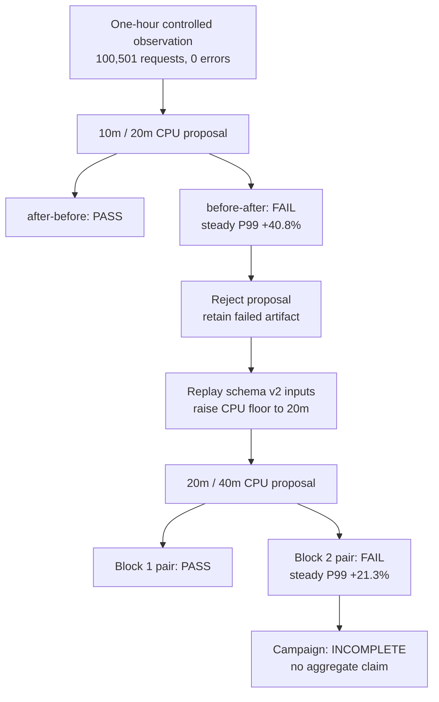

# 0060: Refining a recommendation without erasing a failed validation

- **Date:** 2026-08-25
- **Status:** implemented and locally validated
- **Related phase:** live demo evidence and post-recommendation safety validation
- **Feature commit:** `4fcdada`

## Why

A controlled one-hour observation recommended a `10m` CPU request and `20m` limit for
the two-replica nginx demo. Usage coverage was complete and the projected request-cost
reduction was 98.9%, but a recommendation is not safe merely because its collection
inputs are complete or its saving is large.

The first counterbalanced block exposed that boundary. The candidate-first trial
passed, while the baseline-first trial increased steady latency P99 from `10.723ms` to
`15.098ms`, a 40.8% regression against the fixed 10% policy. Retrying until a favorable
result appeared or relaxing the threshold after seeing the result would defeat the
GitOps safety claim.

## Decision flow



## What changed

- Added `--minimum-cpu-millicores` to live `readiness` and `analyze` policy selection.
- Added `kubefit reanalyze` for schema v2 artifacts. It reuses retained observed usage,
  current resources, price assumptions, replica count, workload identity, and all
  policy inputs while changing only the explicit CPU floor.
- Made refinement monotonic: `reanalyze` rejects a floor below the retained value.
- Kept the global `10m` default unchanged. One nginx experiment is not evidence for
  changing every workload's default recommendation policy.
- Ignored generated result, pair, campaign-plan, and campaign-evidence directories so
  large local evidence bundles are not accidentally committed.

The refined analysis recommended `20m/40m` CPU and `32Mi/48Mi` memory, projecting
request cost from `73.000000` to `1.396125` USD per month under the documented example
rates. That is a 98.1% projection, not an AWS bill guarantee.

## Why reanalysis is safe

Schema v2 already retains the inputs required to replay the recommendation. Reanalysis
does not query a newer idle window, edit the observed percentiles, or claim that old
container status is new evidence. It creates a new analysis and therefore a new
content-addressed proposal.

| Boundary | Behavior |
|---|---|
| Schema v1 input | Rejected because recommendation inputs cannot be replayed |
| Schema v2 input | Fully validated before refinement |
| Higher CPU floor | Recomputed and retained in the new policy snapshot |
| Lower CPU floor | Rejected to prevent opportunistic risk reduction |
| Existing failed benchmark | Preserved unchanged |
| Refined proposal | Requires a new benchmark and preregistered campaign |

## Live evidence

### Controlled observation

| Signal | Result |
|---|---:|
| Requests | 100,501 |
| Dropped iterations | 0 |
| Error rate | 0% |
| Usage coverage | 100% |
| Throttling coverage | 100% |
| Readiness | `eligible` |

### Candidate outcomes

| Proposal | Trial or block | Outcome | Steady P99 result |
|---|---|---|---|
| `10m/20m` CPU | candidate first | PASS | -4.4% |
| `10m/20m` CPU | baseline first | FAIL | +40.8% |
| `20m/40m` CPU | repeated block 1 pair | PASS | both orders passed |
| `20m/40m` CPU | repeated block 2 pair | FAIL | one order +21.3% |

Every run completed its fixed offered load, observed zero request errors, zero OOMKilled
events, zero CPU throttling P95, successful traffic-spike recovery, and restored the
original `1000m/2000m`, `2Gi/4Gi` Deployment resources. The failures came from the
predeclared steady P99 regression gate, so cost savings did not override latency.

The refined campaign remains machine-readably `incomplete`: one of two planned pairs
completed, block 2 remains, and no campaign evidence artifact or aggregate effect was
published. The first self-contained pair remains a valid MVP pair gate, but it must not
be described as repeated-campaign proof.

## Automated verification

```text
Ruff: passed
Python: 394 passed
git diff --check: passed
```

Tests cover explicit positive floor parsing, policy retention, schema v2 refinement,
preservation of observation and price inputs, and rejection of a lower floor.

## Limitations and next question

The relative latency gate is sensitive when localhost latency is near 10ms: the final
failure was a 21.3% relative change but roughly 2.48ms absolute. This record does not
retroactively add an absolute tolerance or weaken the 10% policy. A future benchmark
policy version could preregister both relative and absolute budgets, but it must retain
its policy inputs in the artifact before existing evidence can be compared safely.

How should versioned benchmark policies represent relative and absolute latency
budgets without invalidating older content-addressed results during semantic replay?
