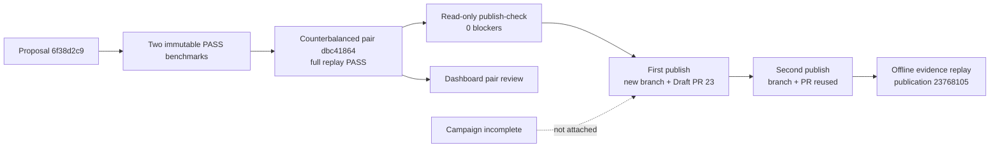
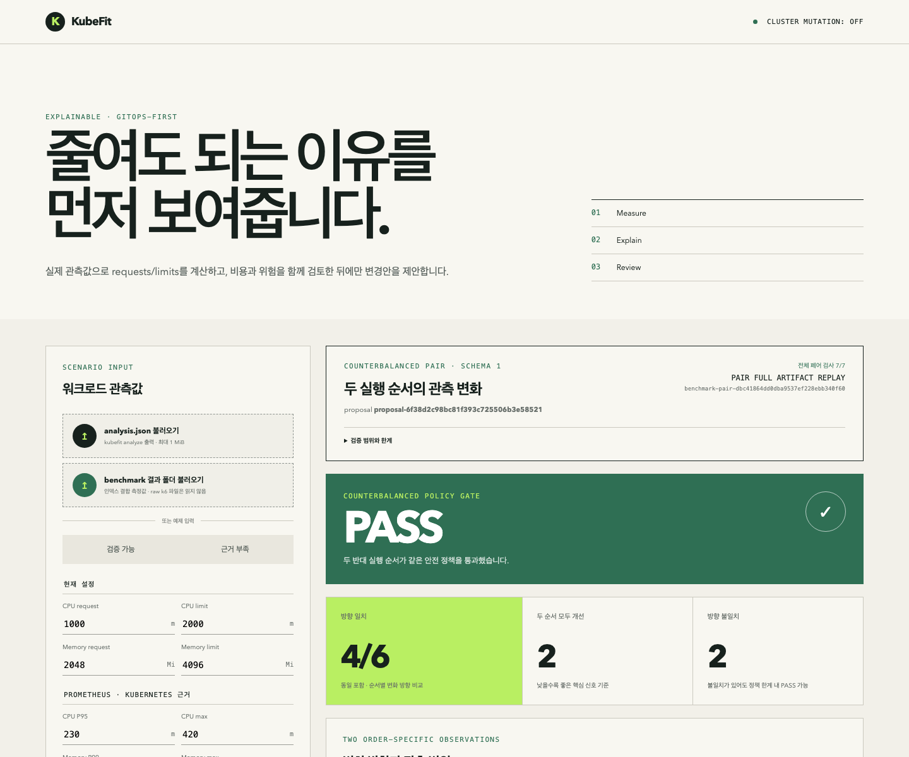

# 0061: Publishing the verified pair while keeping the campaign incomplete

- **Date:** 2026-08-25
- **Status:** live validated
- **Related phase:** GitOps Draft PR and review evidence
- **Resource Draft PR:** [#23](https://github.com/sangmu1126/kubefit/pull/23)

## Why

The refined proposal produced one fully verified counterbalanced PASS pair, but its
preregistered two-pair campaign remained incomplete after the second block failed the
steady P99 policy. KubeFit's mandatory publication gate requires the pair; campaign
evidence is an explicit optional attachment. The live demo therefore needed to prove
both sides of that contract:

- publish only the evidence that actually passed;
- leave every campaign field absent instead of presenting an incomplete experiment as
  repeated validation.

## Live flow

## Publication result

| Field | Result |
|---|---|
| Proposal | `proposal-6f38d2c98bc81f393c725506b3e58521` |
| Mandatory benchmark | `benchmark-7d60c1a768704ed666df0af687fa7155` |
| Pair | `benchmark-pair-dbc41864dd0dba9537ef228ebb340f60` |
| Planned branch | `kubefit/kubefit-demo-overprovisioned-api-6f38d2c9` |
| Commit | `2919b909931d615c09f5c6d24562513de0f48cb1` |
| Draft PR | `#23` |
| Changed files | 1 |
| First publish | branch and PR created |
| Second publish | same branch and PR reused |
| Offline verification | `publication-237681056e77c6b99a7b1935bc275cd8` |
| Campaign evidence ID | `null` |

The PR proposes CPU `1000m/2000m → 20m/40m` and memory `2Gi/4Gi → 32Mi/48Mi`.
Under the explicit example rates, request cost changes from `73.000000` to `1.396125`
USD per month, or -98.088%. The PR labels this as a projection rather than an AWS bill
reduction.

## Review surface

The right side of the capture is the stored live pair identified above. The API fully
replayed both result bundles, seven pair checks, and six order-aware metric signals
before showing `PASS`. The left `SCENARIO INPUT` panel is the dashboard's editable
example analysis and is not the source of the pair verdict; it is retained in the
capture so that this UI boundary is visible rather than cropped away.

## Verification

The read-only preflight reported:

- artifact, local repository, remote, and GitHub API checks `ready`;
- no local or remote deterministic branch before publication;
- zero blockers and `mutation_performed: false`.

The second identical publication returned both `branch_reused: true` and
`pull_request_reused: true`. Five captured files—preflight, first publish, second
publish, remote ref, and GitHub PR—then passed `kubefit verify-publication`. The replay
bound the proposal, both benchmark IDs, pair ID, branch, commit, PR body, Draft state,
and one-file change into the verification identity.

GitHub CI on PR #23 passed Python 3.12, 3.13, and 3.14 plus Dashboard, Helm, and Docker.
The PR remains Draft. KubeFit did not mark it ready, merge it, deploy it, or mutate the
live kind workload after benchmark restoration.

## Evidence boundary

| Claim | Status |
|---|---|
| One counterbalanced pair passed | Supported |
| Draft PR generation is idempotent | Supported |
| PR review data matches local artifacts | Supported by offline replay |
| Two-pair campaign completed | Not supported; explicitly incomplete |
| Statistical significance | Not calculated |
| Real AWS invoice saving | Not measured |
| Production deployment safety | Not claimed from the controlled demo |

## Next question

The review is technically complete but the screenshot combines an editable example
analysis with the stored pair panel. Should a future dashboard route hide unrelated
scenario inputs when an immutable benchmark, pair, or campaign query is active?
