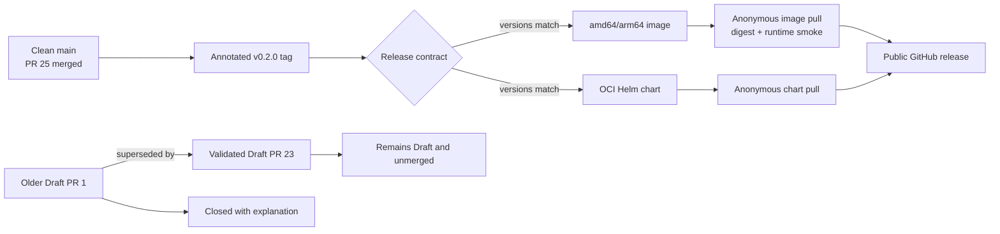

# 0062: Publishing v0.2.0 only after anonymous package verification

- **Date:** 2026-08-25
- **Status:** released
- **Related phase:** submission release and public distribution
- **Release:** [v0.2.0](https://github.com/sangmu1126/kubefit/releases/tag/v0.2.0)
- **Package workflow:** [run 32751718176](https://github.com/sangmu1126/kubefit/actions/runs/32751718176)

## Why

Passing source tests did not prove that another person could install KubeFit. A valid
submission release also needed one immutable source identity, consistent package
versions, publicly readable packages, and a runnable published image. Creating a
GitHub release before those checks would turn an intended distribution contract into
an unverified claim.

The repository also contained two generated Draft resource PRs for the same demo
Deployment. Keeping both open made the human-review boundary ambiguous even though
neither had been merged or deployed.

## Release flow

The public release is downstream of anonymous verification. It is not used as the
signal that publication succeeded.

## What was published

| Artifact | Identity | Verification |
|---|---|---|
| Source | annotated `v0.2.0` → `9b6dbf712d30f29f5af90d25a68002d6e36d9ea8` | tag type and version files checked |
| Container | `ghcr.io/sangmu1126/kubefit:0.2.0` | amd64/arm64 push, anonymous digest pull, runtime smoke |
| Helm chart | `oci://ghcr.io/sangmu1126/charts/kubefit --version 0.2.0` | anonymous OCI pull |
| Release page | `v0.2.0` | public, non-draft, non-prerelease |

The version was aligned in Python package metadata, the FastAPI application,
dashboard package metadata, and Helm `version`/`appVersion`. Release preparation
passed Ruff, 394 Python tests, 15 dashboard tests, the production dashboard build,
Helm lint/render, and wheel metadata inspection before the tag was pushed.

## GitOps review cleanup

Draft PR [#23](https://github.com/sangmu1126/kubefit/pull/23) remains the only open
resource proposal. It contains the current validation-backed patch and stays Draft so
KubeFit cannot silently cross the human approval boundary. Older Draft PR #1 changed
the same demo manifest and was closed with an explicit link to #23. Closing it did not
merge or deploy either proposal.

## Claim boundary

| Claim | Status |
|---|---|
| The tagged image and chart are publicly pullable | Supported by a fresh anonymous job |
| The published image starts and answers its health check | Supported by release smoke test |
| Package versions refer to the tagged source | Supported by the release contract job |
| The resource recommendation was deployed | Not claimed; PR #23 remains Draft |
| Savings occurred on an AWS bill | Not claimed; the cost model is illustrative |
| The incomplete two-pair campaign became valid | Not claimed; it remains incomplete |

The workflow emitted one maintenance warning: a pinned Docker Buildx action still
targets the deprecated Node.js 20 action runtime and GitHub currently forces Node.js
24. It did not affect this release, but updating the pinned action is the first
supply-chain maintenance task rather than a reason to rewrite validated evidence.

## Decision

KubeFit `v0.2.0` is a complete submission release: source, packages, GitOps evidence,
limitations, and installation boundary are public and mutually consistent. Remaining
work is presentation packaging or explicitly post-MVP engineering, not an unimplemented
core code path.

## Next question

For the presentation, which three-minute path best demonstrates the distinction
between a large projected saving and KubeFit's refusal to publish when latency evidence
fails?
