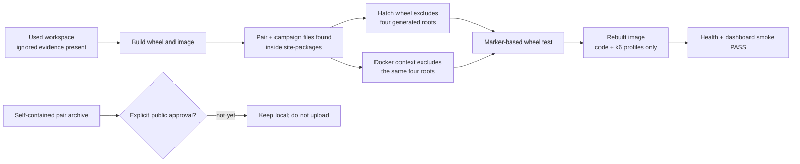

# 0063: Keeping generated evidence out of distributable packages

- **Date:** 2026-08-25
- **Status:** locally validated; public distribution completed in record 0064
- **Related phase:** post-release reproducibility audit
- **Fix commit:** `1efad9c fix: exclude generated benchmark evidence from packages`

> **Follow-up:** Explicit approval was provided after this audit. Record
> [0064](0064-public-replayable-pair-demo.md) documents the later public Release asset,
> anonymous redownload, digest match, and one-command replay. The boundary below
> describes the state before that approval.

## Why

The release workflow builds from a clean Git checkout, but a maintainer normally builds
from a working directory that contains ignored observations, proposals, benchmark
results, pairs, and campaign plans. The wheel configuration treated the entire
`benchmarks` Python package as package data. As a result, an ignored local pair and two
ignored campaign plans entered a locally built wheel and Docker image even though Git
would never publish them.

That created two risks:

- the same source commit produced different package contents on clean and used
  workspaces;
- a local image could unintentionally distribute raw benchmark evidence that its owner
  had not approved for publication.

## Audit flow



The important conclusion is that `.gitignore` is a source-control boundary, not a
package-content boundary. Wheel selection and Docker context selection must each state
their own generated-data exclusions.

## What changed

Both package paths now exclude:

```text
benchmarks/results
benchmarks/pairs
benchmarks/campaigns
benchmarks/campaign-evidence
```

The wheel regression test creates one uniquely named marker in every generated root,
builds a real wheel through Hatchling, and verifies all four markers are absent. It
also verifies that `benchmarks/k6/resource_profile.js` and
`benchmarks/k6/observation_profile.js` remain present, preventing an overly broad fix
that would make installed benchmark execution fail. A second assertion keeps
`.dockerignore` aligned with the wheel contract.

## Evidence

| Check | Before | After |
|---|---:|---:|
| KubeFit wheel size in Docker build | about 636 KB | about 107 KB |
| Generated pair files inside image | Present | Absent |
| Generated campaign files inside image | Present | Absent |
| Required installed k6 profiles | Present | Present |
| Runtime health and packaged dashboard | Passed | Passed |
| Python suite | 394 tests | 396 tests passed |

Ruff, 396 Python tests, 15 dashboard tests, the production Vite build, Helm lint, a
fresh Docker build, image file inspection, and runtime smoke all passed. The existing
local kind Helm release was then advanced from chart/app `0.1.0` to `0.2.0`, restarted
onto the audited local image, and verified through its Service for both `/healthz` and
the packaged React document. Prometheus and the demo Deployment were not changed.

## Demo evidence boundary

The verified pair directory is self-contained and contains both order-specific result
bundles plus raw k6 evidence. It is about 14 MB uncompressed and 507 KB as a gzip tar
archive. A secret/path scan found no token, authorization header, local user path,
email address, API key, or symlink. Its local archive SHA-256 is:

```text
c646b4483083f8fcedafb397d1cc2355391bc9f98b15a6b157e22b30f2793239
```

Inspection and compression do not authorize public distribution. The attempted
Release upload was stopped at the external-publication boundary, so the archive is not
a published KubeFit asset and documentation must not link to it yet.

## Decision

The package-contamination defect is fixed and guarded. The public `v0.2.0` packages
were built from a clean checkout and did not contain the ignored local data, so this
audit does not invalidate that release. It does show why clean-CI success alone was
insufficient to prove local build reproducibility.

## Next question

Resolved in record 0064: the inspected archive was published after explicit approval
and is now consumed only through a pinned-digest, read-only demo path.
