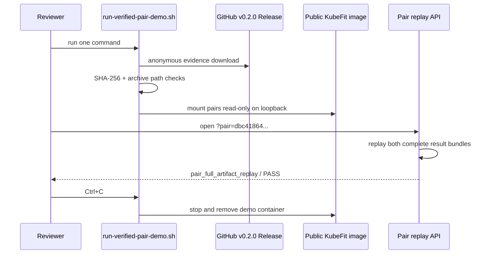

# 0064: Replaying the public verified pair from one command

- **Date:** 2026-08-25
- **Status:** public and anonymously verified
- **Related phase:** competition demo reproducibility
- **Release asset:** [kubefit-demo-evidence-v0.2.0.tar.gz](https://github.com/sangmu1126/kubefit/releases/download/v0.2.0/kubefit-demo-evidence-v0.2.0.tar.gz)

## Why

The React dashboard and full pair API worked locally, but a clean clone did not contain
the ignored 14 MB pair directory. A reviewer could see the committed screenshot and
GitHub Draft PR, yet could not independently open the exact `PAIR FULL ARTIFACT REPLAY`
screen without receiving local files out of band. Committing raw generated data into
the source tree would have reversed the package boundary fixed in record 0063.

The demo needed a separate evidence distribution channel with an immutable identity,
anonymous access, explicit publication approval, and a short path that did not require
Kubernetes, Prometheus, Python, or Node.js.

## Public replay flow



The script is an evidence consumer, not another trust authority. The API still reads
and validates the complete pair directory before it returns the review model.

## Distribution contract

| Field | Value |
|---|---|
| Asset | `kubefit-demo-evidence-v0.2.0.tar.gz` |
| Public size | 519,133 bytes |
| SHA-256 | `c646b4483083f8fcedafb397d1cc2355391bc9f98b15a6b157e22b30f2793239` |
| Pair | `benchmark-pair-dbc41864dd0dba9537ef228ebb340f60` |
| Image | `ghcr.io/sangmu1126/kubefit:0.2.0` |
| Network bind | `127.0.0.1:8000` by default |
| Evidence mount | read-only |
| Cluster access | none |

Before publication, the archive was scanned for token, authorization, password,
secret, API/access-key, local user path, email, and symlink indicators. Publication
occurred only after explicit approval. GitHub reports the same `sha256:c646...93239`
digest as the inspected local archive.

## Implementation

`deploy/local/run-verified-pair-demo.sh`:

1. validates required commands and the loopback port;
2. downloads the versioned Release asset into ignored `.kubefit/demo/` storage;
3. accepts either `sha256sum` or macOS `shasum`, requiring the pinned digest;
4. rejects absolute and parent-traversing archive entries before extraction;
5. extracts into a temporary directory and validates the three pair root files;
6. moves complete evidence into a digest-addressed cache;
7. mounts only the `pairs` root read-only into the published image;
8. prints the exact pair URL and runs the container in the foreground with `--rm`.

A second run reuses the verified archive and extracted evidence rather than downloading
again. Operators may change the loopback port and image reference explicitly, but the
pair and evidence digest remain source constants.

## Live verification

The asset was downloaded again from its public browser URL without `gh` credentials,
and the downloaded SHA-256 matched. Extraction produced both embedded trial bundles.
KubeFit replay returned:

```text
verification_level: pair_full_artifact_replay
status: pass
checks: 7/7 pass
```

The one-command script was then run from an empty cache. It downloaded both the asset
and public image, served the React document, returned `{"status":"ok"}` from health,
and returned the complete pair review from the API. Ctrl+C shut down and removed the
container. A second run emitted no download step and started from the verified cache.
Ruff, 399 Python tests, 15 dashboard tests, the production Vite build, Helm lint, and
the repository diff check passed after the demo contract was added.

## Claim boundary

| Claim | Status |
|---|---|
| A fresh clone can reproduce the stored pair dashboard | Supported |
| Evidence and image are publicly readable | Supported by anonymous pulls |
| The dashboard verdict is backed by full pair replay | Supported |
| The demo recollects current Kubernetes metrics | Not claimed |
| The pair establishes statistical significance | Not claimed |
| Draft PR #23 was merged or deployed | Not claimed; it remains Draft |

## Next question

The technical demo path is now one command. The remaining work is presentation design:
which screen sequence best explains why two mixed spike metrics can coexist with a
policy PASS without hiding uncertainty?
