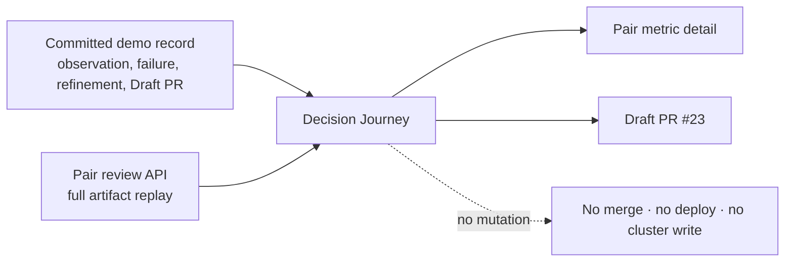

# 0065: Showing the decision, not only the passing result

- **Date:** 2026-08-26
- **Status:** implemented and locally integrated
- **Related phase:** submission presentation and evidence review
- **Feature commit:** `166e3dc`

## Why

The existing Pair dashboard accurately replayed the evidence, but it placed the
immutable Pair review beside an unrelated editable scenario form. A reviewer could
verify `PASS` but could not see, in one surface, why the first recommendation was
rejected, how the refinement was constrained, or where automation stopped.

The goal was not another recommendation engine or a second source of truth. It was a
read-only presentation path over already recorded evidence and the existing Pair
review API.

## Decision boundary



The diagram separates historical narrative from live verification: recorded numbers
link to committed development evidence, while `PASS`, 7/7 checks, metric directions,
and candidate throttling come from the current API response.

## What changed

- Added `/?showcase=decision-journey` as a focused route that removes the editable
  scenario column.
- Visualized `observe → reject → refine → verify → propose` as a five-stage flow.
- Kept the rejected `10m/20m` CPU candidate and its `+40.804%` steady P99 regression
  visible instead of presenting only the successful refinement.
- Connected the fixed public Pair
  `benchmark-pair-dbc41864dd0dba9537ef228ebb340f60` to the existing full-replay API.
- Displayed the two mixed spike signals and the incomplete campaign limitation beside
  the passing Pair.
- Linked the `20m/40m`, `32Mi/48Mi` refinement, example-rate cost projection, and
  Draft PR #23 back to their committed evidence.
- Added unavailable-state behavior: the recorded story remains visible, but the UI
  does not claim `PASS` if the Pair API cannot replay the evidence.

## Demo compatibility discovered during implementation

Changing the existing demo URL directly would have been incorrect. Its default image
is immutable `v0.2.0`, which predates the Showcase route. The script therefore keeps
opening Pair detail for the public image and adds an explicit current-source path:

```bash
KUBEFIT_DEMO_BUILD_LOCAL=true ./deploy/local/run-verified-pair-demo.sh
```

That option builds `kubefit:decision-journey`, mounts the same digest-pinned public
Pair read-only, and opens the Showcase. A future release containing the route can
change the default without pretending an older image contains new code.

## Integrated result

The current-source image was built and run on loopback port 18002 with the released
Pair evidence mounted read-only. The live API returned:

| Check | Result |
|---|---|
| Health | `ok` |
| Verification | `pair_full_artifact_replay` |
| Pair policy | `pass` |
| Pair checks | 7/7 |
| Metric directions | 2 improved, 2 mixed, 2 unchanged |
| New frontend bundle | Decision Journey copy present |

The temporary container was stopped and automatically removed. No Kubernetes or AWS
endpoint was contacted.

## Automated verification

```text
Dashboard: 18 passed
Demo script: 4 passed
Dashboard production build: passed
Docker current-source build: passed
Live loopback Pair replay: passed
git diff --check: passed
```

Tests cover the successful fixed-Pair replay, evidence links, removal of editable
inputs, API-unavailable state, invalid Showcase ID, shell syntax, pinned public
evidence identity, and the explicit current-source build path.

## Evidence boundary

| Claim | Status |
|---|---|
| One counterbalanced Pair passed | API replayed |
| Failed aggressive candidate was retained | Recorded and linked |
| Example request-cost projection is -98.088% | Recorded; not an AWS bill |
| Repeated campaign completed | Not supported; explicitly incomplete |
| Statistical significance | Not calculated |
| Production safety or automatic deployment | Not claimed |

## Next question

Should the next release promote this route to the default public demo, or should the
submission retain Pair detail as the primary technical review and use Decision Journey
only for the timed presentation?
