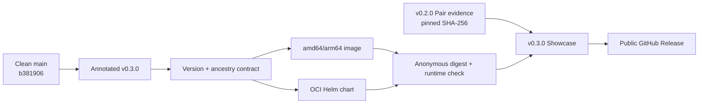

# 0066: Releasing the Showcase without rewriting its evidence

- **Date:** 2026-08-26
- **Status:** released and anonymously verified
- **Related phase:** final submission packaging
- **Release:** [v0.3.0](https://github.com/sangmu1126/kubefit/releases/tag/v0.3.0)
- **Package workflow:** [run 32871351979](https://github.com/sangmu1126/kubefit/actions/runs/32871351979)
- **Release commit:** `b381906242193c06781f13a121e6a23f4598c5ab`

## Why

The Decision Journey was merged to `main`, but the public `v0.2.0` image predated
that frontend. Requiring a source build during judging would make the final demo
slower and leave the published image inconsistent with the documented Showcase URL.

The release also could not pretend the historical benchmark was newly collected.
The correct boundary was a new application package over the same immutable public
Pair evidence.

## Release flow



The application identity advanced to `v0.3.0`; the evidence identity did not. The
demo script names those two versions separately so this relationship is executable,
not only explanatory text.

## What changed

- Aligned Python, Dashboard, Helm chart, and chart `appVersion` at `0.3.0`.
- Changed the published-image demo route to `/?showcase=decision-journey`.
- Kept evidence download on the public
  `kubefit-demo-evidence-v0.2.0.tar.gz` asset with SHA-256
  `c646b4483083f8fcedafb397d1cc2355391bc9f98b15a6b157e22b30f2793239`.
- Preserved `KUBEFIT_DEMO_BUILD_LOCAL=true` for unreleased working-tree validation.
- Did not attach a duplicate evidence archive to `v0.3.0`.

## Published identities

| Artifact | Identity | Verification |
|---|---|---|
| Source | annotated `v0.3.0` → `b381906242193c06781f13a121e6a23f4598c5ab` | tag type, ancestry, versions |
| Container | `ghcr.io/sangmu1126/kubefit:0.3.0` | amd64/arm64 publish and anonymous runtime |
| Container digest | `sha256:de71a0acc2817edc308fb97cce764c023a8a7db1393abf562adb1aeeed5c95a8` | workflow and fresh local pull |
| Helm chart | `oci://ghcr.io/sangmu1126/charts/kubefit --version 0.3.0` | anonymous pull |
| Release page | `v0.3.0` | public, non-draft, non-prerelease |

The publishing workflow completed the release contract, chart publication,
multi-architecture build, and a separate anonymous verification job. Its only
annotations were the already-recorded Node.js 20 action-runtime deprecation warnings;
GitHub forced those pinned Docker actions onto Node.js 24 and every job passed.

## Public demo verification

The default command was run after removing any possibility of satisfying the image
reference with the locally tagged build:

```bash
./deploy/local/run-verified-pair-demo.sh
```

Docker reported that `ghcr.io/sangmu1126/kubefit:0.3.0` was absent locally, pulled it
from GHCR, and resolved the published digest above. The running image then returned:

| Check | Result |
|---|---|
| Runtime user | `10001:10001` |
| Health | `ok` |
| Pair verification | `pair_full_artifact_replay` |
| Pair status | `pass` |
| Pair checks | 7/7 |
| Pair metrics | 6 |
| Showcase bundle | `비용보다 안전을` present |

The evidence directory was mounted read-only, the service bound only to loopback, and
Ctrl+C shut down and removed the demo container.

## Preparation gates

```text
Ruff: passed
Python: 400 passed
Dashboard: 18 passed
Dashboard production build: passed
Helm lint/default render: passed
Wheel metadata: kubefit 0.3.0
Local v0.3.0 image + Pair replay: passed
PR CI and tagged-main CI: passed
Anonymous release verification: passed
Public-image Showcase replay: passed
```

## Claim boundary

| Claim | Status |
|---|---|
| Anyone can pull and run the v0.3.0 image and chart | Verified anonymously |
| The default demo opens the Decision Journey | Verified from the public image |
| The Pair still passes full server replay | Verified, 7/7 checks |
| v0.3.0 contains a newly collected experiment | Not claimed; evidence is reused |
| Cost projection is an AWS bill saving | Not claimed |
| Campaign completion or statistical significance | Not claimed |
| Draft PR #23 was merged or deployed | Not performed |

## Next question

The release engineering path is closed. Which screenshots and three-minute narration
best communicate the rejected candidate, retained limitations, and human approval
boundary without turning the presentation into an implementation tour?
