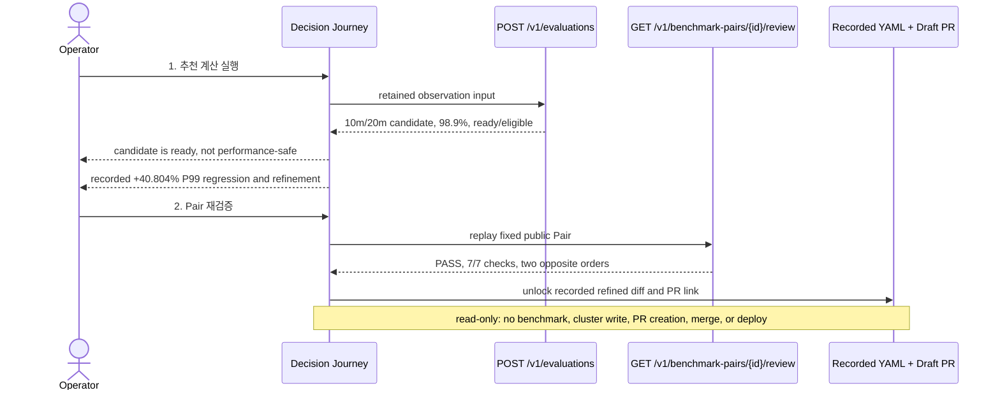

# 0067: Turning the Showcase into an operator-triggered demo

- **Date:** 2026-08-26
- **Status:** implemented and locally integrated
- **Related phase:** submission demonstration
- **Feature commit:** `e435cbb`

## Why

The released Decision Journey told the correct story and replayed the Pair API, but
it did so automatically when the page opened. A reviewer saw a finished `PASS` page
without a visible action, so the surface did not answer the basic demo question:
“what did I just make KubeFit execute?”

Adding animation or pretending to collect a new benchmark would only hide that
problem. The useful change was to expose two existing server operations as explicit
operator actions while keeping historical measurements visibly separate from live
recalculation.

## Runtime and evidence boundary



The first response is calculated by the running application from retained input.
The rejection, refinement, YAML diff, and Draft PR are recorded evidence. The second
response is a current full-artifact replay of that fixed public Pair. Labels in the
UI state which category each value belongs to.

## What changed

- Replaced entry-time Pair fetching with an idle `WAITING FOR OPERATOR` state.
- Added a first button that sends the retained one-hour controlled observation to
  the existing evaluation API and displays its recommendation, cost projection,
  readiness, and patch gate.
- Explained that `ready / eligible` means sufficient analysis input, not proven
  performance safety, beside the retained failed 10m benchmark.
- Added a second button that calls the existing full Pair review API.
- Kept Pair detail, the exact refined YAML diff, and Draft PR #23 locked until the
  Pair replay returns `PASS`.
- Added explicit `RECORDED INPUT`, `RECORDED BENCHMARK`, `RECORDED REANALYSIS`,
  `LIVE API`, and `RECORDED GITOPS` labels.
- Preserved API failure behavior without converting a failed call into a visual
  success state.

## Why this is still read-only

The timed demo needs to be reliable and understandable, not destructive. It does
not rerun k6, change a Deployment, create a new branch, or call GitHub mutation APIs.
Those workflows already have retained evidence and separate executable paths. The
interactive surface recomputes the deterministic recommendation and re-verifies the
published Pair, then opens the recorded handoff only after verification.

## Verification

```text
Ruff: passed
Python: 400 passed (one upstream Starlette deprecation warning)
Dashboard: 18 passed
Dashboard production build: passed
Docker current-source build: passed
Packaged health: ok
Packaged recommendation: 10m/20m, 32Mi/48Mi, 98.9%, ready/eligible
Packaged Pair replay: pass, 7/7 checks, 6 metrics
Packaged frontend: both operator actions present
git diff --check: passed
```

The dashboard test asserts that page entry performs no fetch, checks the retained
observation POST body, confirms that PR links remain locked after recommendation,
then triggers Pair replay and verifies the YAML and Draft PR are exposed. A separate
test preserves the failure state when the triggered Pair replay is unavailable.

## Claim boundary

| Claim | Status |
|---|---|
| The recommendation code runs when the first button is pressed | Verified |
| The fixed Pair is fully replayed when the second button is pressed | Verified |
| The refined YAML and Draft PR are gated on replay `PASS` | Verified in UI tests |
| The one-hour observation or benchmark is recollected during the demo | Not performed |
| Kubernetes, GitHub, or AWS is mutated | Not performed |
| `ready` alone proves performance safety | Explicitly rejected |

## Next question

The public `v0.3.0` image is immutable and predates these operator actions. A patch
release must package this interaction before the default public demo can claim it.
