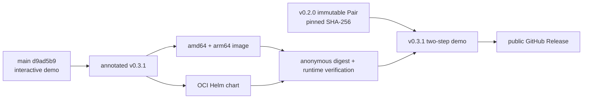

# 0068: Publishing the operator-triggered demo as v0.3.1

- **Date:** 2026-08-26
- **Status:** released and anonymously verified
- **Related phase:** final submission packaging
- **Release:** [v0.3.1](https://github.com/sangmu1126/kubefit/releases/tag/v0.3.1)
- **Package workflow:** [run 32928617554](https://github.com/sangmu1126/kubefit/actions/runs/32928617554)
- **Release commit:** `d9ad5b9528d9757100fed1d70a6d0e42b5691f7a`

## Why

Entry 0067 fixed the demo on `main`, but the one-command path still selected the
immutable `v0.3.0` image. Leaving it there would make the repository describe buttons
that a reviewer could not see in the published package. The interaction therefore
needed a patch release; overwriting `v0.3.0` would have broken release identity.

## Release boundary



Only the application package advanced. The benchmark Pair remains the original
`v0.2.0` release asset and is still checked against its pinned SHA-256 before it is
mounted read-only.

## Published identities

| Artifact | Identity | Verification |
|---|---|---|
| Source | annotated `v0.3.1` → `d9ad5b9528d9757100fed1d70a6d0e42b5691f7a` | tag type, main ancestry, aligned versions |
| Container | `ghcr.io/sangmu1126/kubefit:0.3.1` | multi-architecture publish and anonymous runtime |
| Container digest | `sha256:8723d2ec04e627acd4b18442e03c9a13211eab10d3d5aeebf8fe9b7f7790ef10` | workflow and fresh local pull |
| Helm chart | `oci://ghcr.io/sangmu1126/charts/kubefit --version 0.3.1` | anonymous pull |
| Release page | `v0.3.1` | public, non-draft, non-prerelease |

## Public-image verification

The default command was run after confirming that `0.3.1` was absent locally:

```bash
./deploy/local/run-verified-pair-demo.sh
```

Docker downloaded the public image and the running package returned:

| Check | Result |
|---|---|
| Runtime user | `10001:10001` |
| Health | `ok` |
| Operator actions in bundle | recommendation and Pair replay present |
| Live recommendation | `10m/20m`, `32Mi/48Mi`, `98.9%`, `ready/eligible` |
| Pair verification | `pair_full_artifact_replay` |
| Pair verdict | `pass`, 7/7 checks, 6 metrics |

The service used loopback only. Pair evidence was mounted read-only. No Kubernetes,
GitHub mutation, or AWS endpoint was contacted.

## Preparation gates

```text
Ruff: passed
Python: 400 passed
Dashboard: 18 passed
Dashboard production build: passed
Helm lint/default render: passed
Feature PR #32 CI: passed
Release PR #33 CI: passed
Tagged-main CI: passed
Anonymous image/chart verification: passed
Fresh public-image interactive API verification: passed
```

The release workflow emitted only the known action-runtime annotations: GitHub ran
pinned actions that still declare Node.js 20 on Node.js 24. Every job passed.

## Claim boundary

| Claim | Status |
|---|---|
| The public image contains the two visible operator actions | Verified |
| The public image recalculates the retained recommendation | Verified |
| The public image fully replays the fixed Pair | Verified, 7/7 |
| The demo recollects Prometheus data or reruns k6 | Not performed |
| The evidence was newly generated for v0.3.1 | Not claimed |
| Kubernetes, Draft PR #23, or AWS was changed | Not performed |

## Next question

Implementation and public packaging are closed. The remaining work is rehearsal:
capture the idle, rejected-candidate, and verified-output states and deliver the
three-minute explanation without implying production evidence.
