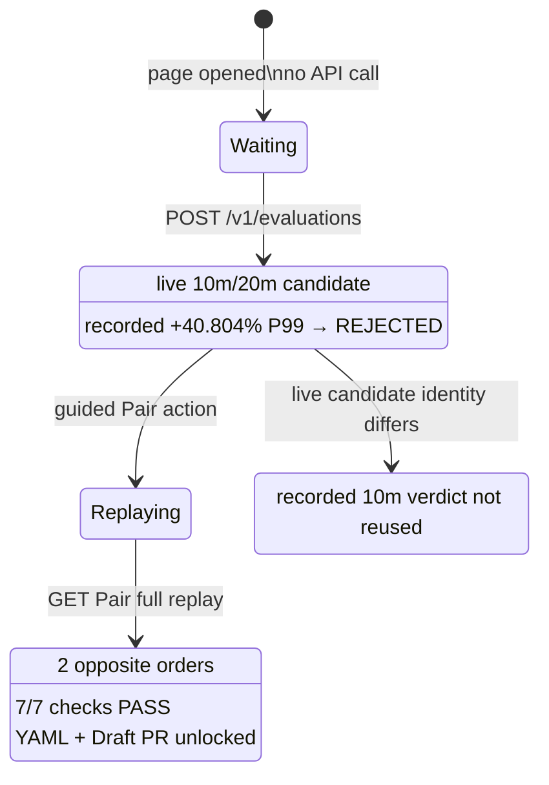

# 0069: Making the decision visible, not only clickable

- **Date:** 2026-08-26
- **Status:** implemented and locally packaged
- **Related phase:** submission demonstration
- **Feature commit:** `e72cf47`

## Why

The operator-triggered Showcase proved that two real APIs ran, but it still presented
their outcome mostly as text and summary cards. During a timed demonstration, a
reviewer had to infer how the current allocation became a rejected candidate, why
readiness did not imply safety, and what the counterbalanced replay actually checked.

The missing capability was not another optimizer. It was one visual surface that
connected input, calculation, rejection, refinement, verification, and GitOps output
without representing recorded measurements as newly executed work.

## Visual state flow



The visual conclusion is sequential: the recommendation is allowed to finish, but
GitOps evidence stays locked until the independent performance replay passes. If a
future algorithm returns a value other than the recorded 10m candidate, the old
failure is not silently attached to it.

## What changed

- Replaced the sparse live-result card with a dark Decision Console that is visible
  before execution and accumulates evidence after each operator action.
- Added CPU and memory tracks for `CURRENT REQUEST → OBSERVED → LIVE CANDIDATE →
  VERIFIED`. Width uses a labeled logarithmic scale so 3.66m, 10m, 20m, and 1000m
  remain distinguishable without implying a linear bar comparison.
- Added a central performance gate that makes `10m REJECTED → 20m VERIFIED` the
  primary decision instead of emphasizing savings alone.
- Added an execution trace whose rows explicitly identify `LIVE`, `RECORDED`,
  `POLICY`, `SYSTEM`, and `ERROR` sources.
- Added a guided `20m Pair 검증 계속` action next to the rejected candidate so the
  presenter does not have to search for the second step.
- Visualized both measurement orders with their steady-latency before/after values.
- Expanded the real Pair response into a visible policy-check rack; the public Pair
  produces 7/7 `PASS` checks.
- Preserved the exact YAML diff and Draft PR unlock after verification.
- Added responsive layouts for two-column and single-column displays.

## Trust boundary added during implementation

The first implementation assumed the live recommendation would always remain 10m.
That is true for the retained input today but would become misleading after an
algorithm change. The final implementation compares the live CPU candidate with the
recorded rejected-candidate identity:

| Live candidate | Decision Console behavior |
|---|---|
| `10m` | Show the retained `+40.804%` P99 rejection |
| any other value | Show `UNBENCHMARKED`; do not reuse the 10m verdict |

This keeps the visual story subordinate to evidence identity rather than hardcoding
a successful presentation path.

## Verification

```text
Ruff: passed
Python: 400 passed (one upstream Starlette deprecation warning)
Dashboard: 19 passed
Dashboard production build: passed
Docker current-source build: passed
Packaged health: ok
Packaged frontend: Decision Console, resource tracks, guided CTA, Pair proof present
Public Pair response: pass, 7/7 checks, before-after + after-before orders
git diff --check: passed
```

Dashboard tests now cover the waiting console, live resource response, rejected
candidate trace, guided second action, Pair proof, verified resource track, GitOps
unlock, API failure, and the changed-candidate `UNBENCHMARKED` boundary.

## Claim boundary

| Claim | Status |
|---|---|
| The visual values come from the live evaluation or replay response | Verified |
| Source categories distinguish live and recorded evidence | Implemented |
| The bars are linear comparisons | Not claimed; labeled log scale |
| The console streams backend log events | Not claimed; it renders verified state transitions |
| A different live candidate inherits the recorded 10m verdict | Explicitly prevented |
| Kubernetes, GitHub, benchmark, or AWS mutation occurs | Not performed |

## Next question

The source-built visual demo is ready. It needs a patch release before the default
public-image command can expose the same Decision Console.
