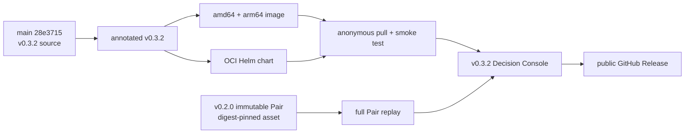

# 0070: Publishing the Visual Decision Console as v0.3.2

- **Date:** 2026-08-26
- **Status:** released and anonymously verified
- **Related phase:** final submission packaging
- **Release:** [v0.3.2](https://github.com/sangmu1126/kubefit/releases/tag/v0.3.2)
- **Package workflow:** [run 32951637377](https://github.com/sangmu1126/kubefit/actions/runs/32951637377)
- **Release commit:** `28e3715f57c79745141681bdfe843d19bb8ca2dd`

## Why

Entry 0069 made the decision path legible on `main`, but a source-only UI change was
not enough for a reviewer using the one-command public demo. The public `v0.3.1`
image still contained the earlier sparse presentation. The visual console therefore
needed a new immutable patch release and verification from a fresh public-image pull.

## What changed

The package now shows the resource path and its decision boundary in one surface:

- CPU and memory tracks connect current request, observation, live candidate, and
  the setting backed by recorded evidence.
- The Performance Gate retains the rejected `10m` candidate and guides the operator
  to the verified `20m` Pair.
- The Pair proof shows both opposite measurement orders, real steady-P99 values,
  and all seven returned policy checks.
- The execution trace distinguishes `LIVE`, `RECORDED`, `POLICY`, `SYSTEM`, and
  `ERROR` sources.
- A live candidate that does not match the recorded rejection is labeled
  `UNBENCHMARKED`; it cannot inherit the old verdict.

## How the public claim is established



The application and presentation package advance to `v0.3.2`. The controlled
benchmark evidence does not: the demo still downloads the reviewed `v0.2.0` Pair,
checks its pinned SHA-256, and mounts it read-only. This prevents a presentation
release from being mistaken for a new measurement run.

## Published identities

| Artifact | Identity | Verification |
|---|---|---|
| Source | annotated `v0.3.2` → `28e3715f57c79745141681bdfe843d19bb8ca2dd` | release contract and main ancestry |
| Container | `ghcr.io/sangmu1126/kubefit:0.3.2` | multi-architecture publish and anonymous runtime |
| Container digest | `sha256:69443bac88c515bd6031266c487d98159ea59fd7076591d573b98b471cade886` | anonymous workflow pull and fresh local pull |
| Helm chart | `oci://ghcr.io/sangmu1126/charts/kubefit --version 0.3.2` | anonymous pull |
| Runtime user | `10001:10001` | fresh local image inspection |
| Release page | `v0.3.2` | public, non-draft, non-prerelease |

## Evidence

Before tagging, the audited source passed:

```text
Ruff: passed
Python: 400 passed
Dashboard: 19 passed
Dashboard production build: passed
Current-source Docker build and health: passed
Feature PR #35 CI: passed
Release PR #36 CI: passed
Tagged-main CI: passed
```

The release workflow then passed four independent jobs: tag/version contract,
multi-architecture image publication, OCI chart publication, and credential-free
package verification. The last job anonymously pulled the image, started it, checked
health, and anonymously pulled the chart.

The default demo command was subsequently run against a fresh public `0.3.2` pull:

```bash
./deploy/local/run-verified-pair-demo.sh
```

The downloaded bundle contained the Decision Console, resource-track labels,
guided Pair action, counterbalanced proof, execution trace, GitOps unlock, and the
`UNBENCHMARKED` boundary. The API independently returned:

| Check | Result |
|---|---|
| Pair verification | `pair_full_artifact_replay` |
| Pair verdict | `pass` |
| Policy checks | 7/7 passed |
| steady P99, before → after | `13.19549 → 11.64682 ms` (`-11.736358%`) |
| steady P99, after → before | `12.962 → 10.95152 ms` (`-15.510569%`) |

These are the two observed order-specific results. They are not presented as a
confidence interval or proof of production representativeness.

## Decision boundary

| Claim | Status |
|---|---|
| The public package contains the visual decision path | Verified |
| The public package fully replays the retained Pair | Verified, 7/7 |
| A changed live candidate reuses an unrelated recorded verdict | Prevented |
| The demo recollects Prometheus data or reruns k6 | Not performed |
| Kubernetes, GitHub, or AWS is mutated by the demo | Not performed |
| The retained Pair is newly generated v0.3.2 evidence | Not claimed |

## Next question

Feature and package work are closed for submission. The remaining uncertainty is
presentation delivery: rehearse the idle → rejected → verified sequence and capture
fallback screenshots or video in case the venue cannot pull the public image.
