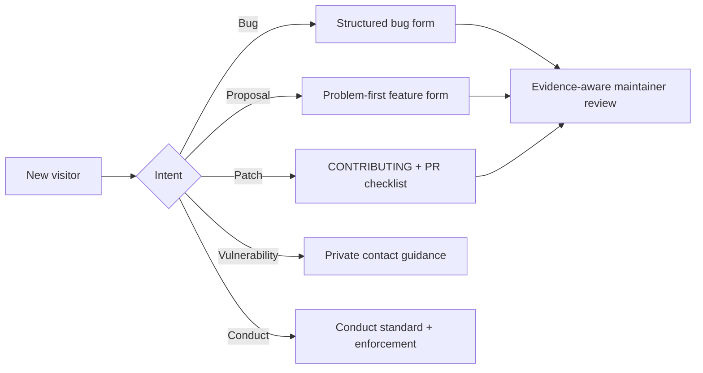

# 0071: Making contribution and reporting paths explicit

- **Date:** 2026-08-26
- **Status:** complete
- **Related phase:** open-source submission readiness

## Why

KubeFit already published source, packages, installation instructions, automated
quality gates, and 70 development records. That made the result inspectable, but not
yet welcoming: a new contributor had no single contribution contract, issue forms,
pull-request checklist, conduct standard, or private security-reporting guidance.
Describing community readiness in a contest report without those files would overstate
the repository's actual open-source surface.

## Decision

Add the smallest honest maintainer-facing layer now, without pretending that KubeFit
already has a multi-maintainer community or guaranteed service-level response.

The forms request evidence and safety boundaries that match the software itself.
They do not require a complex governance model before a contributor can participate.

## What changed

- `CONTRIBUTING.md` defines setup, quality gates, design rules, development records,
  and focused pull-request expectations.
- `CODE_OF_CONDUCT.md` sets community behavior, scope, reporting, enforcement, and
  Contributor Covenant 2.1 attribution.
- `SECURITY.md` identifies supported versions, an honest private-contact route, and
  product security boundaries.
- YAML issue forms separate reproducible bugs from problem-first feature proposals.
- The pull-request template requires exact evidence, secret hygiene, read-only and
  restoration boundaries, compatibility review, and documentation.
- README links make these paths discoverable.

## Rejected shortcuts

| Option | Reason rejected |
|---|---|
| Claim community processes only in the result report | The public repository would contradict the claim |
| Point to GitHub private vulnerability reporting | Repository setting is currently disabled |
| Promise a fixed response SLA | A single-maintainer project cannot honestly guarantee it |
| Add governance roles that do not exist | Creates appearance rather than usable accountability |
| Use only free-form issues | Does not guide reporters away from secrets or unsupported claims |

## Evidence

Three repository tests validate that all expected files exist, both issue forms parse
as YAML, README links are discoverable, and the PR template retains KubeFit's safety
boundaries. The complete verification result was Python 403 passed, Dashboard 19
passed plus production build, Helm lint/render passed, current-source Docker
build/runtime passed, and public `v0.3.2` Pair replay passed 7/7. The contest report
can now describe these contribution paths as implemented rather than planned.

## Claim boundary

KubeFit now has a documented contribution surface. It does not claim an established
external contributor community, a formal steering committee, guaranteed response
times, or enabled GitHub private vulnerability reporting.

## Next question

After submission, which real newcomer task should become the first `good first issue`,
and what feedback from that contributor should simplify the setup path?
