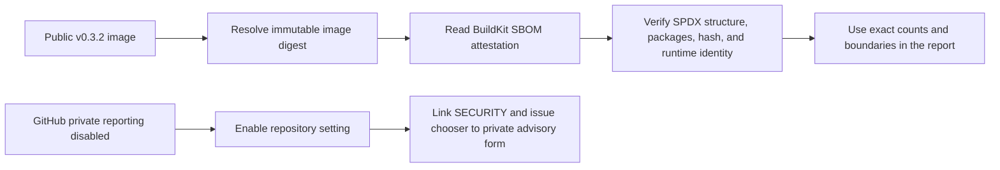

# 0072: Hardening Submission Evidence Instead of Adding Scope

- **Date:** 2026-08-27
- **Status:** validated
- **Related phase:** Open-source submission readiness
- **Commits:** `a9d0c3d fix: provide private vulnerability reporting path`; evidence-boundary documentation in this entry's commit

## Why

The implementation was complete, but a final claim audit found three credibility
gaps: the documented private security contact did not exist, the report's seven-row
dependency summary could be mistaken for a complete SBOM, and the report compressed
mixed benchmark outcomes into a favorable `20m` result. Those gaps were more
important to fix than adding another presentation feature.

## Success criteria

- A reporter can open a real private vulnerability report without using a public issue.
- The public `v0.3.2` image has a machine-readable SPDX inventory bound to the
  verified image digest, with scanner blind spots stated explicitly.
- Submission text distinguishes direct-dependency summaries, full SBOM evidence,
  one passing Pair, one failing repeated block, and an incomplete campaign.
- Historical failure and limitation records remain intact.

## What changed

- Enabled GitHub private vulnerability reporting for the public repository and linked
  `SECURITY.md` plus the issue chooser directly to its private advisory form.
- Pulled `ghcr.io/sangmu1126/kubefit:0.3.2` anonymously at digest
  `sha256:69443bac88c515bd6031266c487d98159ea59fd7076591d573b98b471cade886`.
- Generated and verified an SPDX 2.3 inventory containing 131 packages. Its manifest
  binds the inventory to that image ID, numeric runtime user, byte size, and SHA-256.
- Corrected the contest report's development-record count and narrowed portability,
  extensibility, community, benchmark, and dependency claims.

## Evidence flow



The report now separates a human-readable direct-dependency summary from
machine-readable image evidence instead of treating a short appendix as exhaustive
inventory. The compiled dashboard's dependency lock remains the source for bundled
JavaScript packages that the final-image scanner may not identify separately.

## Alternatives and trade-offs

| Option | Benefit | Cost or risk | Decision |
|---|---|---|---|
| Add more product features | Larger visible surface | Does not repair evidence credibility | Rejected |
| Publish only seven major libraries as “the SBOM” | Short appendix | Omits transitive and OS packages | Rejected |
| Remove failed repeated benchmarks | Cleaner story | Cherry-picks evidence | Rejected |
| Enable private reporting and correct claims | Makes public promises usable and auditable | Adds no headline feature | Selected |

## Problems encountered

The existing local SBOM belonged to an older `kubefit:dev` image and reported KubeFit
`0.1.0`; it could not support a `v0.3.2` submission claim. Pulling the exact public
release and running the existing verifier produced a separate digest-bound artifact.
The original GitHub profile fallback was also unusable because the public profile had
no contact method, so the repository setting itself had to be enabled.

## Evidence

```bash
gh api repos/sangmu1126/kubefit/private-vulnerability-reporting
docker pull ghcr.io/sangmu1126/kubefit:0.3.2
KUBEFIT_IMAGE_REFERENCE=ghcr.io/sangmu1126/kubefit:0.3.2 \
  ./deploy/local/generate-image-sbom.sh
```

| Signal | Result | Interpretation |
|---|---|---|
| Private vulnerability reporting | `enabled: true` | The documented private path exists |
| Public image digest | `sha256:69443bac…cade886` | Matches the verified v0.3.2 release |
| Runtime identity | `10001:10001` | Matches the release contract |
| SPDX format | `SPDX-2.3` | Machine-readable inventory |
| SPDX package count | 131 | Includes runtime application, transitive, and OS packages |
| SPDX SHA-256 | `95479dbc…3d886` | Detects local inventory changes |
| Python verification | 403 passed | Repository behavior unchanged |
| Dashboard verification | 19 passed; production build passed | Documentation hardening did not regress the UI |

## Decision and limitations

This evidence supports reproducible package inventory and an operational private
reporting route. It does not constitute vulnerability scanning, artifact signing,
license-compliance certification, a response-time SLA, or proof of an established
external contributor community. The 131-package image inventory is scanner output,
not a guarantee that compiled frontend dependencies were all identified. The
benchmark remains a controlled local observation: one `20m/40m` Pair passed, another
repeated block failed one order, and the campaign is incomplete.

## Next question

Which submission fields and video URL will the operator provide before the final form
is frozen?
