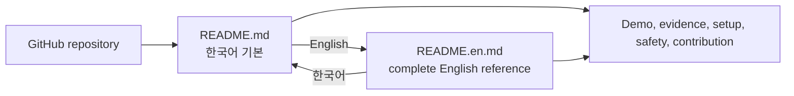

# 0073: Making Korean the Default Without Dropping the English Reference

- **Date:** 2026-08-27
- **Status:** validated
- **Related phase:** Open-source submission readiness
- **Commits:** `76f26ba docs: make Korean README the default`; development record in this entry's commit

## Why

The public repository opened with a long English-only README even though the contest
review, primary maintainer communication, and expected first audience are Korean. A
short Korean cover page would improve the first impression but could hide the exact
commands, evidence boundaries, and limitations already documented in English.

## Success criteria

- GitHub renders Korean as the default repository README.
- The complete existing English reference remains available from the first screen.
- Both documents link back to the other language.
- The Korean path retains the verified demo, installation, analysis, GitOps safety,
  benchmark limitations, SBOM boundary, contribution, security, and license details.
- Moving the package README does not break tests or the Python build metadata.

## What changed

- Moved the complete English reference to `README.en.md` and added a Korean link at
  its top.
- Added a Korean-first `README.md` with a direct English selector.
- Organized the Korean document around evaluator and newcomer needs: problem,
  differentiation, verified evidence, one-command demo, repository structure,
  installation, live analysis, safety gates, GitOps, benchmark evidence, SBOM, and
  contribution paths.
- Updated the English evidence count to the current 403 Python tests and linked the
  later open-source evidence records.

## Navigation

The language switch changes the entry point, not the underlying product claim.

## Alternatives and trade-offs

| Option | Benefit | Cost or risk | Decision |
|---|---|---|---|
| Keep English only | No maintenance split | Higher friction for the primary contest audience | Rejected |
| Add only a short Korean summary | Quick | Safety and evidence details become English-only | Rejected |
| Translate every implementation paragraph line-for-line | Maximum symmetry | Default README remains unnecessarily long and harder to scan | Rejected |
| Korean evaluator path plus complete English reference | Clear default and no English information loss | Two entry documents require synchronized claims | Selected |

## Evidence

Validation checks both language links, required community-file discovery from the
default README, Python tests, lint, Dashboard tests/build, Helm rendering, and package
metadata consumption of the new Korean `README.md`.

| Check | Result |
|---|---|
| Korean → English → Korean navigation | passed |
| Required local README targets | present |
| Python | 403 passed |
| Ruff | passed |
| Dashboard | 19 passed; production build passed |
| Python wheel | `kubefit-0.3.2-py3-none-any.whl` built; Korean Markdown metadata present |

## Problems encountered

The first combined validation used `path` as a zsh loop variable. In zsh, lowercase
`path` is a special array tied to `PATH`, so the loop replaced the executable search
path and 30 subprocess-based tests could no longer find `git` or `bash`. The failures
were environmental, not product regressions. A fresh shell restored `PATH`; rerunning
the unchanged source passed all 403 tests. Later link checks use `link_target` instead.

## Decision and limitations

The Korean README is a complete usage and evidence entry point, but it intentionally
does not translate every low-level publication implementation paragraph from the
497-line English reference. `README.en.md` remains the detailed source for those
internals. Future changes to versions, test counts, or benchmark claims must update
both documents when the fact appears in both.

## Next question

After real Korean newcomers use the repository, which section causes the first setup
or evidence-interpretation question?
