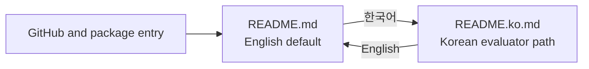

# 0074: Restoring English as the Global Open-Source Entry Point

- **Date:** 2026-08-27
- **Status:** validated
- **Related phase:** Open-source submission readiness
- **Commits:** `82dbc46 docs: restore English as default README`; development record in this entry's commit

## Why

Entry 0073 improved accessibility for the Korean contest audience by making Korean
the default README. A final submission review separated that audience need from the
repository's longer-lived role as a public open-source project. GitHub and Python
package visitors should encounter the complete English reference by default, while
Korean evaluators still need a one-click native-language path.

## Success criteria

- `README.md` is the complete English reference rendered by GitHub and package
  metadata consumers.
- `README.ko.md` preserves the Korean evaluator and newcomer path without content loss.
- Both documents link directly to the other language from the top.
- Local links, package metadata, tests, and builds remain valid.
- The historical rationale in entry 0073 remains intact rather than being rewritten.

## What changed

- Moved the Korean document from `README.md` to `README.ko.md`.
- Moved the complete English document from `README.en.md` back to `README.md`.
- Updated both language selectors and left every product, evidence, safety, and
  limitation statement unchanged.

## Navigation

This changes discoverability, not functionality or benchmark evidence.

## Alternatives and trade-offs

| Option | Benefit | Cost or risk | Decision |
|---|---|---|---|
| Keep Korean default | Best immediate contest accessibility | Less conventional global OSS entry | Rejected |
| Remove Korean version | One document to maintain | Loses native-language evaluator path | Rejected |
| English default with Korean selector | Conventional global entry and Korean accessibility | Claims must remain synchronized | Selected |

## Evidence

Validation checks both language selectors, all referenced local paths, Python package
metadata, Python tests and lint, Dashboard tests/build, Helm rendering, and Docker
packaging through CI.

## Decision and limitations

English is the default repository language, not the only supported documentation
language. This decision does not imply established international adoption. Future
version, test-count, and benchmark-claim changes must update both files when shared.

## Next question

Which facts should be generated from one source to prevent the two README variants
from drifting after submission?
