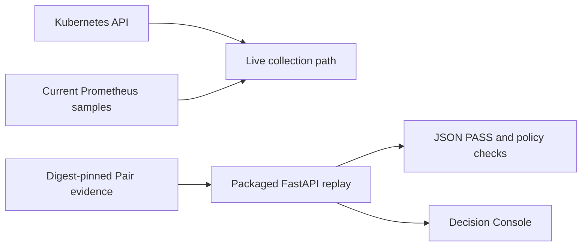

# 0075: Making the Demo Runtime Observable

- **Date:** 2026-08-27
- **Status:** validated
- **Related phase:** Open-source submission readiness
- **Commits:** development record in this entry's commit

## Why

The Decision Console explains KubeFit's decision path, but showing only that surface
can make the project look like a scripted frontend. A reviewer also needs a compact
way to see the Docker runtime, the optional live Kubernetes and Prometheus collection
path, and the FastAPI endpoint that independently replays the retained Pair. Those
signals must not blur current idle Prometheus samples into the historical controlled
benchmark verdict.

## Success criteria

- Both README languages provide one copyable walkthrough for Docker, Kubernetes,
  Prometheus, FastAPI health, and Pair replay inspection.
- The walkthrough needs only one terminal window with two tabs.
- Live Prometheus inspection is explicitly optional for the Docker-only replay.
- Documentation states that current Prometheus samples did not produce the retained
  Pair verdict.
- Every referenced command and local link remains valid.

## What changed

Added an observable-runtime subsection beside the one-command Showcase in both
READMEs. It shows the running kind and monitoring workloads, the original Deployment
resources, a live per-Pod CPU PromQL query, packaged API health, and a compact view of
the full Pair replay response.

## How



The documentation keeps the two paths adjacent but does not join them. Kubernetes and
Prometheus demonstrate how a new analysis is collected. The public Showcase mounts a
previously released Pair read-only and asks the current server to validate it again.

### Alternatives and trade-offs

| Option | Benefit | Cost or risk | Decision |
|---|---|---|---|
| Show only the dashboard | Shortest recording | Can look frontend-only | Rejected |
| Record a new one-hour load run | Entire pipeline is temporally continuous | Long, fragile, and unnecessary for review | Rejected |
| Show live scrape plus retained replay | Makes both runtime paths observable | Requires a precise evidence-boundary explanation | Selected |
| Show Docker Desktop GUI | Familiar visual container list | Adds no stronger proof than CLI status and API response | Rejected |

## Problems encountered

The original quick start correctly minimized prerequisites, but that optimization hid
the runtime evidence useful in a submission video. Adding Prometheus without a clear
boundary would create the opposite problem: a reviewer could assume current samples
caused the historical PASS. The new wording names that separation next to the commands.

## Evidence

### Reproduction

```bash
docker ps
kubectl --context kind-kubefit get pods -n monitoring
kubectl --context kind-kubefit get pods -n kubefit-demo
curl --fail http://127.0.0.1:8000/healthz
curl --silent \
  http://127.0.0.1:8000/v1/benchmark-pairs/benchmark-pair-dbc41864dd0dba9537ef228ebb340f60/review \
  | jq '{status, verification_level, benchmark_ids, checks: [.checks[].status]}'
```

### Results

| Signal | Observed result | Interpretation |
|---|---|---|
| Docker runtime | Published `v0.3.2` demo and kind control plane running | Container and cluster paths are real processes |
| Monitoring namespace | Prometheus, operator, state metrics, and node exporter Ready | Live collection dependencies are available |
| Demo workload | 2/2 target Pods Ready | The overprovisioned Deployment remains inspectable |
| Resource state | `1/2` CPU cores and `2Gi/4Gi` memory request/limit | The live target matches the documented starting configuration |
| API health | `{"status":"ok"}` | Packaged FastAPI is serving independently of the UI |

## Decision and limitations

The README now supports a defensible terminal-first recording without making Docker
Desktop, a hosted SaaS, or a new hour-long measurement mandatory. A running local
cluster proves the collection components exist; it does not turn current idle metrics
into controlled-demo evidence. The retained Pair remains the only source of the shown
historical PASS.

## Next question

Can a fresh external machine complete the same walkthrough without undocumented local
state or maintainer assistance?
