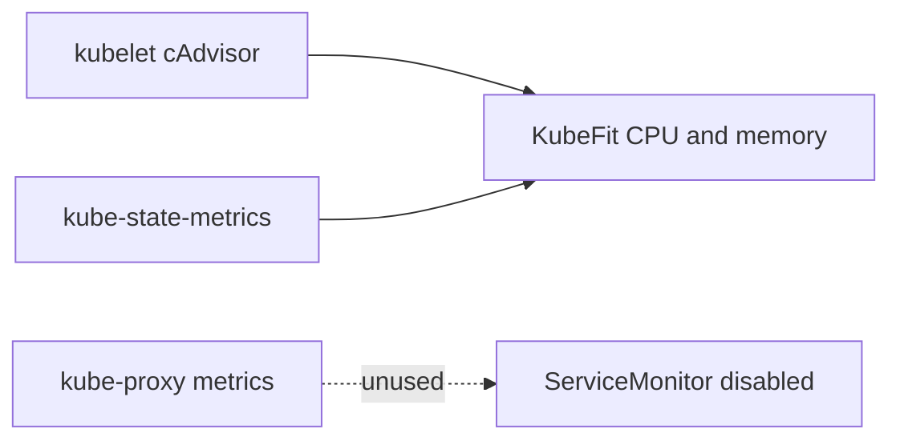

# 0076: Removing the Unused Kube-Proxy Scrape Target

- **Date:** 2026-08-27
- **Status:** validated
- **Related phase:** Open-source submission readiness
- **Commits:** development record in this entry's commit

## Why

The local kube-prometheus-stack created a kube-proxy ServiceMonitor by default. In the
kind cluster, its `172.19.0.2:10249/metrics` endpoint refused connections and appeared
as the only `DOWN` target. KubeFit does not consume kube-proxy metrics, so retaining the
target added misleading scrape noise without increasing recommendation evidence.

## Success criteria

- The source-controlled local values disable only kube-proxy monitoring.
- The live Helm release reflects the same setting.
- Prometheus retains the kubelet/cAdvisor and workload-state inputs KubeFit requires.
- The active target set contains no kube-proxy target and no unhealthy target.

## What changed

Set `kubeProxy.enabled: false` in the focused local Prometheus values and documented
why it is outside KubeFit's metric boundary. No Kubernetes workload, recommendation,
benchmark artifact, or production chart default changed.

## How



### Alternatives and trade-offs

| Option | Benefit | Cost or risk | Decision |
|---|---|---|---|
| Expose the kube-proxy metrics listener | Makes the default target green | Expands a listener for data KubeFit does not use | Rejected |
| Ignore the DOWN target | No configuration change | Misleading local health and demo noise | Rejected |
| Disable its ServiceMonitor | Target set matches actual metric needs | No kube-proxy diagnostics in this minimal stack | Selected |

## Problems encountered

Prometheus itself, kubelet, cAdvisor, and kube-state-metrics were healthy; only the
default kube-proxy scrape failed with `connection refused`. Treating the whole server
as unhealthy would have diagnosed the wrong component. Inspecting the exact scrape URL
and the collector queries showed that this endpoint was unrelated to KubeFit.

## Evidence

### Reproduction

```bash
helm --kube-context kind-kubefit get values monitoring -n monitoring -a
curl --fail --silent http://127.0.0.1:9090/api/v1/targets \
  | jq '[.data.activeTargets[] | select(.health != "up")]'
```

### Results

| Signal | Before | After | Interpretation |
|---|---:|---:|---|
| kube-proxy active targets | 1 DOWN | 0 | Unused scrape removed |
| All unhealthy targets | 1 | 0 | Focused target set is healthy |
| Demo workload CPU series | 2 Pods | 2 Pods | Required cAdvisor input preserved |

## Decision and limitations

The minimal local stack intentionally does not provide kube-proxy diagnostics. This is
not a claim that kube-proxy itself was unhealthy, nor does it change what a production
Prometheus installation may collect. KubeFit's workload resource analysis remains
dependent on healthy kubelet/cAdvisor and Kubernetes workload metadata.

## Next question

Should the local setup add an executable assertion that every enabled scrape target is
both required and healthy?
