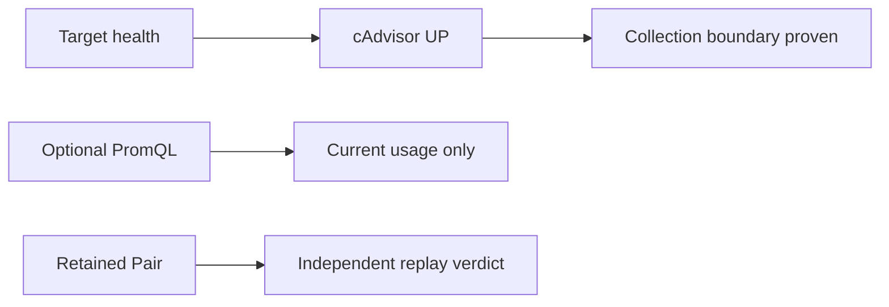

# 0077: Making Target Health the Default Prometheus Walkthrough

- **Date:** 2026-08-27
- **Status:** validated
- **Related phase:** Open-source submission readiness
- **Commits:** development record in this entry's commit

## Why

The observable demo walkthrough used a valid CPU PromQL query, but the intentionally
idle nginx Deployment correctly returned `0m`. That result can look broken and can
tempt a reviewer to generate unnecessary local load merely to animate a graph. The
walkthrough only needs to prove that KubeFit's metric source is reachable before the
separate retained Pair is replayed.

## Success criteria

- Both README languages make kubelet/cAdvisor target health the default check.
- The exact endpoints relevant to collection are named.
- PromQL remains available for optional inspection.
- Idle `0m` is identified as valid rather than failure.
- Target health is not represented as benchmark or recommendation evidence.

## What changed

The default walkthrough now filters Prometheus Target health for kubelet and confirms
`/metrics`, `/metrics/cadvisor`, and `/metrics/probes` as `UP`. The existing CPU query
is retained as an optional diagnostic with an explicit idle-workload explanation.

## How

### Alternatives and trade-offs

| Option | Benefit | Cost or risk | Decision |
|---|---|---|---|
| Generate synthetic traffic | Animated graph | Heat, extra process, and claim confusion | Rejected |
| Remove PromQL | Simplest walkthrough | Loses a useful diagnostic example | Rejected |
| Target health first, query optional | Stable and technically precise | Does not visualize current utilization by default | Selected |

## Evidence

The live target set reported no unhealthy target after entry 0076. The kubelet
`/metrics/cadvisor` endpoint remained `UP`, while the optional query returned two valid
Pod series. With no traffic those values were `0m`; memory remained about `7.1Mi`,
confirming that zero CPU was workload state rather than collection failure.

## Decision and limitations

Target health proves only that Prometheus can scrape an endpoint. It does not prove
adequate observation coverage, safe recommendations, performance improvement, or a
Pair verdict. Those remain separate KubeFit readiness and artifact-replay decisions.

## Next question

Should a future read-only diagnostic command summarize the exact Prometheus targets
and labels required by KubeFit without requiring users to navigate the Prometheus UI?
