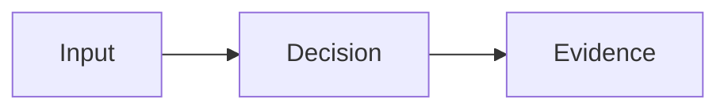

# NNNN: Title

- **Date:** YYYY-MM-DD
- **Status:** planned | in progress | validated | superseded
- **Related phase:** Phase N
- **Commits:** `hash summary`

## Why

Describe the user problem, operational risk, or uncertainty. State why it matters
to KubeFit's safety and explainability goals.

## Success criteria

- A measurable behavior or artifact
- A failure condition that must be handled
- Evidence required before the work is considered validated

## What changed

Summarize externally visible behavior and important boundaries. Avoid a file-by-file
changelog; Git already stores that information.

## How

Explain the algorithm, data flow, and constraints.



### Alternatives and trade-offs

| Option | Benefit | Cost or risk | Decision |
|---|---|---|---|
| Example A | | | |
| Example B | | | |

## Problems encountered

Record symptoms, root causes, and fixes. Include failed assumptions and why unit
tests or previous checks did not catch the problem.

## Evidence

### Reproduction

```bash
# Exact commands
```

### Results

| Signal | Before | After | Interpretation |
|---|---:|---:|---|
| Example | | | |

## Decision and limitations

State what the evidence supports. Explicitly list what is not yet safe to claim.

## Next question

Name the single most important uncertainty for the next entry.
