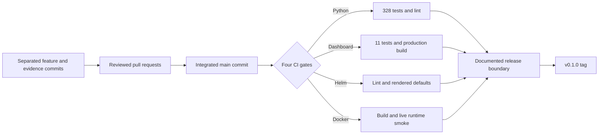

# MVP release readiness

This page is the release decision boundary for KubeFit `v0.1.0`. It connects each
user-facing claim to evidence on the final integrated `main` commit and keeps
post-MVP work out of the release claim.

> **Historical snapshot:** Counts, package availability, and PR state below describe
> the `v0.1.0` boundary. KubeFit later published `v0.2.0`; the older Draft PR #1 was
> closed after the validation-backed Draft PR #23 superseded it. See the
> [current README](../README.md#verified-mvp-evidence) and
> [release record 0062](devlog/0062-verified-v020-release.md) for current evidence.

## Release candidate

| Field | Value |
|---|---|
| Candidate version | `0.1.0` |
| Integrated feature baseline | `caede3391ecf9e9d10633239857bd29bd3cf8991` |
| Release-documentation merge | `075c7220500ac760e17e3290f532b359986a7df7` |
| Integration date | 2026-08-24 |
| Feature-baseline CI | [run 32688444656](https://github.com/sangmu1126/kubefit/actions/runs/32688444656) |
| Documentation-merge CI | [run 32690444806](https://github.com/sangmu1126/kubefit/actions/runs/32690444806) |
| Source status | MVP feature phases and release documentation complete |
| Published artifacts | None; image and chart publication are post-MVP |

## Why the tag comes last

A tag should identify a commit whose behavior and limitations are already explained.
Tagging the implementation before its evidence boundary is checked into `main` would
make the release page more confident than the tagged source itself.

The tag is therefore an output of verified integration, not a substitute for it.

## Evidence matrix

| Release claim | Evidence | Result |
|---|---|---|
| Analyze a Deployment using Kubernetes and Prometheus evidence | Collector, recommendation, readiness, safety, and API regression tests | Passed |
| Recommend CPU P95 and memory P99 requests/limits with explicit margins | Deterministic policy and rounding tests | Passed |
| Separate illustrative request cost from latency, throttling, OOM, restart, and recovery risk | Evaluator and benchmark verdict tests | Passed |
| Generate a minimal stale-safe YAML change | Golden manifest and repository transaction tests | Passed |
| Restore a disposable cluster after before/after execution | [Live benchmark record](devlog/0038-live-demo-benchmark.md) | Passed; 2/2 Ready restored |
| Preserve immutable proposal and benchmark evidence | Artifact hash, replay, and tamper-rejection tests | Passed |
| Open an idempotent human-reviewed Draft PR | [Live GitHub handoff](devlog/0040-live-origin-draft-pr.md) | Passed; Draft PR #1 remains unmerged by design |
| Serve the review UI from the production image | Local image replay and final GitHub Docker job | Passed |
| Install with least-privilege Kubernetes defaults | Helm tests and disposable-kind chart verification | Passed |

The live benchmark used a fixed controlled-demo profile and produced
`benchmark-f84d0caf061d50a5d93bc03088eb0247` with a PASS verdict. Its 98.088%
request-cost reduction is an illustrative model result, not a guaranteed cloud-bill
reduction.

## Final integrated validation

The final `main` commit passed both local and GitHub-hosted checks:

| Gate | Local result | GitHub-hosted result |
|---|---:|---:|
| Python | Ruff passed; 328 tests passed | Passed |
| Dashboard | 11 tests passed; production build passed | Passed |
| Helm | Lint and default render passed | Passed |
| Docker | Image built; startup/runtime smoke passed | Passed |

The Docker smoke starts the packaged image and checks its numeric non-root user,
health response, bundled dashboard, storage-disabled default, failure logging, and
exact-container cleanup. A successful image build alone is not counted as runtime
evidence.

## Release checklist

- [x] MVP phases 1–6 completed and linked to development records.
- [x] Feature work integrated through reviewed, mergeable pull requests.
- [x] Final `main` passed all four hosted CI jobs.
- [x] Final `main` passed the corresponding local checks.
- [x] Real disposable-kind before/after benchmark recorded.
- [x] Real idempotent Draft PR publication recorded.
- [x] Scope exclusions and cost caveats stated in the repository.
- [x] Merge this release-readiness documentation into `main` through PR #6.
- [x] Reconfirm the documentation merge's `main` CI run.

The annotated `v0.1.0` tag is a release operation performed after this source
checklist is complete. Its target must be the final clean `main` commit, and that
exact target must have a successful four-gate CI run. The pushed tag, rather than a
self-referential hash embedded in its own source commit, is the authoritative release
identity.

## Claims intentionally excluded from v0.1.0

KubeFit `v0.1.0` is an MVP and portfolio-grade reference implementation, not a
production-autonomous optimizer. The release does not claim:

- direct production mutation, automatic merge, or automatic rollout;
- HPA recommendations;
- provider-accurate billing or realized invoice savings;
- production-representative conclusions from the controlled one-hour demo;
- raw Prometheus percentile recomputation from stored review artifacts;
- vulnerability-policy enforcement, signed images, provenance attestations, or a
  public image/chart registry;
- multi-cloud support, incident prediction, Terraform generation, or an AI chatbot.

## Rollback and recovery boundary

Benchmark mutation is restricted to an explicitly confirmed disposable `kind-*`
cluster and restores the original manifest on every exit path after mutation starts.
The publication command creates a Draft PR only; it never merges or deploys. At this
historical boundary, Draft PR #1 remained open and unmerged as evidence that the human
approval boundary was preserved; it was later closed when Draft PR #23 superseded it.
